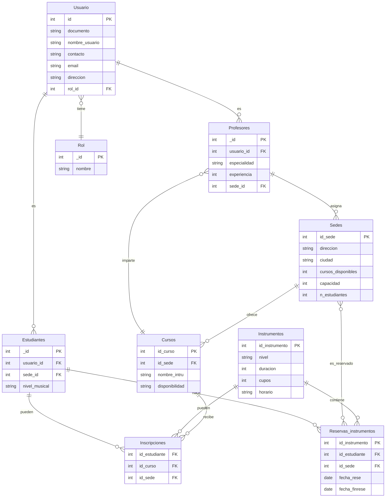
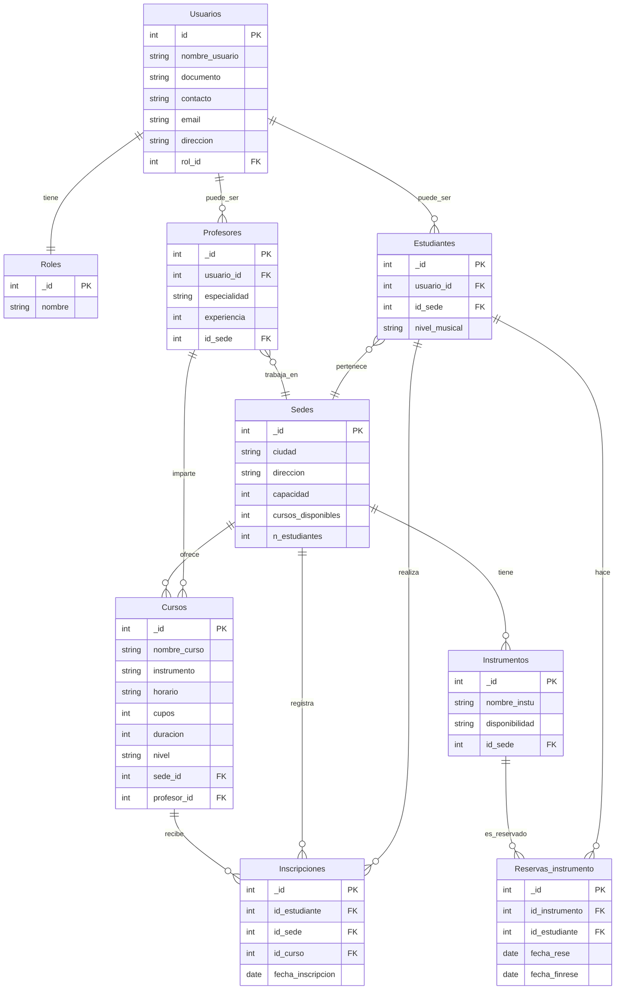

# Proyecto MongoDB 2 Alexi Duran y Esteban Mantilla

Docente. Pedro Felipe Gómez Bonilla // 24 - 10 - 2025

---

# Requerimientos

## Escuelas de Música

**Campus Music** es una empresa que administra múltiples escuelas de música en diferentes ciudades.

Actualmente, usan hojas de cálculo para registrar estudiantes, profesores, cursos e inscripciones, lo que causa duplicación de datos y errores.

Han decidido migrar a **MongoDB** para mejorar la flexibilidad, manejar la información de manera unificada, y soportar operaciones transaccionales en inscripciones. Tu rol será diseñar esta solución, poblarla con datos realistas, implementar consultas analíticas, definir roles de seguridad y demostrar el uso de transacciones.


### Requisitos funcionales del sistema

#### Funcionalidad esperada

El sistema debe permitir:

- Registro de **estudiantes** (nombre, documento, contacto, nivel musical).
- Registro de **profesores** (especialidad, experiencia, cursos asignados).
- Registro de **cursos** (instrumento, nivel, duración, cupos, horario).
- Registro de **sedes** (ciudad, dirección, capacidad, cursos disponibles).
- Gestión de **usuarios** con roles:
- **Administrador**: acceso total.
- **Empleado de sede**: acceso limitado a la sede.
- **Estudiante**: acceso a su información, inscripción y consulta de cursos disponibles.
- **Inscripción de estudiantes** en cursos:
- Validar cupos disponibles.
- tener en cuenta costo y fechaInscripcion.
- Asociar estudiante con curso, sede y profesor.
- Actualizar cupo automáticamente mediante transacción.
- **Reservas de instrumentos** por parte de estudiantes (ej: piano, guitarra, violín).
- Reportes y consultas analíticas:
- Ocupación de cursos por sede.
- Cursos más demandados.
- Profesores con más estudiantes asignados.
- Instrumentos más reservados.
- Histórico de cursos tomados por cada estudiante.

### Estructura del repositorio

```
Tu proyecto debe tener la siguiente estructura y archivos:

📁 campus_music
├── db_config.js         # Creación de colecciones con $jsonSchema e índices
├── test_dataset.js      # Poblamiento de la base con datos de prueba realistas
├── aggregations.js      # Consultas analíticas con framework de agregación
├── roles.js             # Definición de roles y permisos
├── transactions.js      # Transacción de inscripción en curso
└── README.md            # Documentación completa
```

## 

### Descripción detallada de cada archivo

1. db_config.js

**Objetivo:** Definir y crear todas las colecciones del sistema. Cada colección debe tener:

- Un **esquema de validación** $jsonSchema completo:
- Tipos de datos (string, int, date, etc.)
- Campos requeridos
- Reglas de negocio (por ejemplo, valores permitidos con enum)
- Estructuras embebidas si aplica
- **Índices** definidos según las necesidades del sistema:
- Índices simples (ej: placa, cedula)
- Índices compuestos (ej: zona + estado)

Colecciones mínimas obligatorias:

- usuarios (administradores, empleados, estudiantes).
- profesores
- estudiantes
- sedes
- cursos
- inscripciones
- instrumentos
- reservas_instrumentos

2. test_dataset.js

**Objetivo:** Poblar el sistema con datos de prueba coherentes y variados. Usar insertMany.

Debe incluir:

- 3 **sedes** (Ej. Bogotá, Medellín, Cali).
- 5 **cursos por sede** (ej: Piano Básico, Guitarra Intermedia, Violín Avanzado, Teoría Musical, Canto).
- 10 **profesores** con distintas especialidades.
- 15 **estudiantes** con distintos niveles (básico, intermedio, avanzado).
- 20 **instrumentos disponibles** para préstamo (ej: guitarras, pianos, violines).
- 30 **inscripciones**, con estudiantes inscritos en cursos diversos.
- 10 **reservas de instrumentos**.

3. aggregations.js

**Objetivo**: Resolver las siguientes preguntas usando agregaciones de MongoDB. Cada consulta debe estar comentada y explicada.

1. ¿Cuántos estudiantes se inscribieron por sede en el último mes?
2. ¿Cuáles son los cursos más demandados en cada sede?
3. ¿Cuál es el ingreso total generado por inscripciones en cada sede?
4. ¿Qué profesor tiene más estudiantes asignados?
5. ¿Qué instrumento es el más reservado?
6. Mostrar el **historial de cursos de un estudiante** (fecha, sede, curso, profesor, nivel, costo).
7. Listar los **cursos actualmente en ejecución** en cada sede.
8. Detectar cursos que **excedieron el cupo** permitido en algún momento.

4. roles.js

**Objetivo**: Crear y asignar roles con diferentes permisos sobre la base de datos.

Debe incluir:

**Administrador**

- Lectura y escritura total.
- Puede crear usuarios, sedes, cursos, instrumentos.

**Empleado de sede**

- Lectura de estudiantes, profesores y cursos en su sede.
- Puede registrar inscripciones y reservas.
- No puede ver información de otras sedes.

**Estudiante**

- Lectura de su propia información.
- Consulta de cursos disponibles.
- Consulta de su historial de inscripciones.
- Puede reservar instrumentos.

Usar db.createRole() y db.grantRolesToUser() correctamente.

5. transactions.js

**Objetivo**: Crear una transacción MongoDB entre al menos dos colecciones.

Escenario de transacción:

​	 **Inscribir estudiante en un curso**

Pasos:

1. Insertar documento en colección inscripciones.
2. Decrementar cupos_disponibles en la colección cursos.
3. Manejar errores con rollback si algo falla.

Debe incluir:

- Inicio y commit/abort de la transacción.
- Manejo de errores con rollback.
- Comentarios explicando cada paso.

Resultado esperado

Documentar TODO el proyecto en en repositorio de GitHub privado y compartido con las cuentas que el Trainer indique. Este repositorio debe tener un Readme que incluya como mínimo:

Introducción al proyecto

- Justificación del uso de MongoDB
- Diseño del modelo de datos:
- Colecciones creadas
- Decisiones de uso de referencias o embebidos
- Validaciones $jsonSchema
- Explicación de validaciones por colección
- Índices
- Lista de índices creados
- Justificación técnica de su uso
- Estructura de los datos de prueba
- Explicación de cada agregación
- Transacción MongoDB
- Escenario utilizado
- Código explicado paso a paso
- Roles
- Descripción de cada rol
- Ejemplo de creación de usuarios con esos roles
- Conclusiones y mejoras posibles

---

<div align="center">

# Campus Music - Sistema de Gestión de Escuelas de Música

**Proyecto MongoDB**

---

**Autores:** Alexi Durán Gómez y Esteban Mantilla

**Institución:** CAMPUSLANDS

**Ruta:** ARTEMIS - NODE

**Ubicación:** Bucaramanga, Santander

**Año:** 2025

---

</div>

## 📑 Índice

1. [Introducción](#introducción)
   - [Objetivo del Sistema](#objetivo-del-sistema)
   - [Tecnología Utilizada](#tecnología-utilizada)
2. [Caso de Estudio](#caso-de-estudio)
   - [Problemática Actual](#problemática-actual)
   - [Solución Propuesta](#solución-propuesta)
3. [Justificación del Uso de MongoDB](#justificación-del-uso-de-mongodb)
   - [Flexibilidad del Esquema](#1-flexibilidad-del-esquema)
   - [Modelo de Documentos](#2-modelo-de-documentos-orientado-a-objetos)
   - [Capacidades de Agregación](#3-capacidades-de-agregación-avanzadas)
   - [Transacciones ACID](#4-transacciones-acid-multi-documento)
   - [Sistema de Roles](#5-sistema-de-roles-y-autenticación-integrado)
   - [Escalabilidad](#6-escalabilidad-horizontal)
   - [Validación de Esquemas](#7-validación-de-esquemas-json-schema)
4. [Planificación](#planificación)
   - [Construcción del Modelo Conceptual](#construcción-del-modelo-conceptual)
   - [Descripción de Entidades](#descripción)
   - [Modelo Conceptual](#modelo-conceptual)
   - [Descripción Técnica](#descripción-técnica)
5. [Construcción del Modelo Lógico](#construcción-del-modelo-lógico)
   - [Descripción General](#descripción-1)
   - [Descripción de las Entidades](#descripción-de-las-entidades)
   - [Modelo Lógico](#modelo-lógico)
   - [Descripción Técnica del Modelo](#descripción-técnica-1)
6. [Normalización del Modelo Lógico](#normalización-del-modelo-lógico)
   - [Primera Forma Normal (1FN)](#primera-forma-normal-1fn)
   - [Segunda Forma Normal (2FN)](#segunda-forma-normal-2fn)
   - [Tercera Forma Normal (3FN)](#tercera-forma-normal-3fn)
7. [Construcción del Modelo Fisico](#construcción-del-modelo-fisico)
   - [Creación de los Json Schema e Indices](#Creación-de-los-json-schema-e-indices)
   - [Poblado de las Colecciones](#pobladode-las-colecciones)
   - [Creación de Roles](#creación-de-roles)
   - [Agregaciones - Aggregations](#gregaciones---aggregations)
   - [Transaciones - Transactions](#transaciones---transactions)
8. [Referencias](#referencias)

---

<div align="center">

## Introducción

</div>

Este documento presenta la documentación completa del sistema de información desarrollado para **Campus Music**, una empresa que administra múltiples escuelas de música en diferentes ciudades de Colombia. El sistema ha sido diseñado para resolver los problemas actuales de gestión basada en hojas de cálculo, que generan duplicación de datos, inconsistencias y errores operativos.

El desarrollo de este sistema busca ser lo más óptimo posible mediante la implementación de las mejores prácticas de desarrollo con MongoDB, incluyendo:

- Validación de esquemas mediante JSON Schema
- Indexación estratégica para optimizar consultas
- Transacciones ACID para operaciones críticas
- Sistema de roles y permisos para seguridad granular
- Agregaciones avanzadas para reportes analíticos

### Objetivo del Sistema

Proporcionar una plataforma unificada que permita:

- Gestionar estudiantes, profesores, cursos y sedes de manera centralizada
- Controlar inscripciones con validación de cupos en tiempo real
- Administrar el préstamo de instrumentos musicales
- Generar reportes analíticos sobre ocupación, demanda y desempeño
- Implementar control de acceso basado en roles para diferentes tipos de usuarios

### Tecnología Utilizada

El sistema está desarrollado utilizando MongoDB, un sistema de gestión de bases de datos NoSQL orientado a documentos. MongoDB ha sido seleccionado por su flexibilidad, escalabilidad y capacidades avanzadas de agregación, que son ideales para el manejo de información heterogénea y consultas analíticas complejas.

---

<div align="center">

## Caso de Estudio

</div>

**Campus Music** es una organización educativa dedicada a la enseñanza musical que opera en múltiples ciudades de Colombia (Bogotá, Medellín y Cali). La empresa enfrenta varios desafíos operativos:

### Problemática Actual

1. **Duplicación de Información:** Los datos de estudiantes, profesores y cursos se registran en hojas de cálculo separadas por sede, generando inconsistencias cuando un estudiante toma cursos en diferentes ubicaciones.

2. **Errores en Inscripciones:** La falta de validación automática de cupos disponibles ocasiona sobrecupos o inscripciones duplicadas.

3. **Dificultad en Reportes:** Generar estadísticas consolidadas sobre ocupación de cursos, desempeño de profesores o demanda de instrumentos requiere trabajo manual propenso a errores.

4. **Control de Acceso Inadecuado:** No existe un sistema formal de permisos, lo que permite que empleados de una sede accedan a información de otras sedes.

5. **Gestión de Instrumentos:** El control de préstamo de instrumentos musicales (guitarras, pianos, violines) se realiza manualmente sin trazabilidad.

### Solución Propuesta

Migrar a un sistema centralizado basado en MongoDB que:

- Unifique la información de todas las sedes en una base de datos estructurada
- Implemente validaciones automáticas de integridad y reglas de negocio
- Proporcione transacciones para operaciones críticas como inscripciones
- Ofrezca capacidades avanzadas de agregación para análisis y reportes
- Implemente un sistema robusto de roles y permisos

---

<div align="center">

## Justificación del Uso de MongoDB

</div>

La elección de MongoDB como base de datos para Campus Music se fundamenta en varios aspectos técnicos y funcionales:

### 1. Flexibilidad del Esquema

MongoDB permite almacenar documentos con estructuras variables, lo cual es ideal para:

- **Estudiantes con información diferente:** Algunos estudiantes son menores con datos de tutores; otros son adultos con información profesional.
- **Cursos con características diversas:** Cursos grupales vs. individuales, con diferentes duraciones, modalidades y requisitos.
- **Evolución del sistema:** Agregar nuevos campos sin necesidad de migraciones complejas.

### 2. Modelo de Documentos Orientado a Objetos

El formato JSON/BSON de MongoDB se alinea naturalmente con:

- La forma en que las aplicaciones modernas representan datos
- La necesidad de estructuras anidadas (ejemplo: dirección completa de una sede, horarios de cursos)
- La facilidad de integración con aplicaciones JavaScript/Node.js

### 3. Capacidades de Agregación Avanzadas

El framework de agregación de MongoDB permite:

- Realizar análisis complejos sin necesidad de múltiples queries
- Generar reportes consolidados de ocupación, ingresos y demanda
- Implementar pipelines de transformación de datos eficientes
- Calcular estadísticas en tiempo real

### 4. Transacciones ACID Multi-Documento

MongoDB soporta transacciones que garantizan:

- **Atomicidad:** Las inscripciones se completan totalmente o se revierten.
- **Consistencia:** Los cupos siempre reflejan el estado real.
- **Aislamiento:** Múltiples inscripciones simultáneas no generan conflictos.
- **Durabilidad:** Los cambios confirmados persisten ante fallos.

### 5. Sistema de Roles y Autenticación Integrado

MongoDB incluye:

- Control de acceso basado en roles (RBAC)
- Permisos granulares a nivel de colección y operación
- Autenticación integrada sin necesidad de componentes externos

### 6. Escalabilidad Horizontal

Aunque no es crítico en la fase inicial, MongoDB permite:

- Sharding para distribuir datos por múltiples servidores
- Réplicas para alta disponibilidad
- Crecimiento conforme Campus Music expande operaciones

### 7. Validación de Esquemas JSON Schema

MongoDB permite definir:

- Reglas de validación declarativas usando JSON Schema
- Tipos de datos específicos para cada campo
- Restricciones de negocio (valores permitidos, rangos, formatos)
- Validación automática en cada inserción/actualización

---

<div align="center">

## Planificación

</div>

### Construcción del Modelo Conceptual

La construcción del modelo lógico de datos se desarrolló a partir del análisis funcional del sistema de gestión de escuelas de música, el cual busca centralizar la información relacionada con usuarios, profesores, estudiantes, cursos, sedes e instrumentos dentro de una misma estructura. Este modelo refleja la forma en que los datos se organizan y se relacionan entre sí, asegurando la coherencia y la integridad de la información. En el centro del modelo se encuentra la entidad **Usuarios**, que almacena los datos básicos de identificación, contacto y rol de cada persona dentro del sistema. A partir de esta entidad se establecen relaciones con otras tablas especializadas como **Estudiantes** y **Profesores**, las cuales amplían la información según el tipo de usuario. Los estudiantes cuentan con atributos específicos como el nivel musical y la sede a la que pertenecen, mientras que los profesores poseen campos adicionales como especialidad y experiencia.

### Descripción

El diseño del modelo de datos para Campus Music se basa en un análisis cuidadoso de las entidades del negocio y sus relaciones. Se ha optado por un modelo híbrido que combina referencias y documentos embebidos según el patrón de acceso y las necesidades de integridad.

#### Descripción de las Entidades

**1. Usuarios**

Representa a todas las personas que interactúan con el sistema, incluyendo administradores, profesores, empleados y estudiantes. Contiene la información básica de identificación y contacto.

**Atributos:**

- **id (PK):** Identificador único del usuario.
- **nombre_usuario:** Nombre completo del usuario registrado.
- **documento:** Número de identificación personal.
- **contacto:** Número telefónico o medio de comunicación.
- **email:** Correo electrónico del usuario.
- **direccion:** Dirección de residencia o contacto.
- **rol_id (FK):** Rol asignado al usuario dentro del sistema.

Entidad principal que centraliza la información personal y establece la base de conexión con los diferentes tipos de usuarios del sistema.

---

**2. Roles**

Define los distintos tipos de permisos o niveles de acceso dentro de la plataforma, permitiendo diferenciar las funciones de cada usuario.

**Atributos:**

- **id (PK):** Identificador único del rol.
- **nombre:** Nombre del rol (Administrador, Empleado de sede, Estudiante, Profesor).

Entidad que permite gestionar los niveles de acceso y las responsabilidades de los usuarios en el sistema.

---

**3. Estudiantes**

Contiene la información específica de los alumnos inscritos en las escuelas de música, vinculándolos con su usuario base y con la sede a la que pertenecen.

**Atributos:**

- **id (PK):** Identificador único del estudiante.
- **usuario_id (FK):** Referencia al usuario asociado.
- **nivel_musical:** Nivel de conocimiento o experiencia musical del estudiante (básico, intermedio, avanzado).
- **id_sede (FK):** Sede en la que el estudiante se encuentra matriculado.

Entidad encargada de almacenar la información académica de los estudiantes y sus relaciones con los cursos, inscripciones y sedes.

---

**4. Profesores**

Registra los datos de los docentes que imparten los cursos en las diferentes sedes, relacionándolos con su usuario base.

**Atributos:**

- **id (PK):** Identificador único del profesor.
- **usuario_id (FK):** Usuario asociado al profesor.
- **especialidad:** Instrumento o área musical en la que el profesor se desempeña.
- **experiencia:** Años de experiencia o nivel profesional del docente.
- **id_sede (FK):** Sede en la que trabaja el profesor.

Entidad que representa al personal docente y permite vincularlos con los cursos y sedes correspondientes.

---

**5. Sedes**

Representa las distintas ubicaciones físicas donde opera Campus Music. Cada sede puede tener varios cursos, profesores y estudiantes.

**Atributos:**

- **id (PK):** Identificador único de la sede.
- **ciudad:** Ciudad donde se encuentra ubicada la sede.
- **direccion:** Dirección exacta del establecimiento.
- **capacidad:** Número máximo de estudiantes que puede atender la sede.
- **cursos_disponibles:** Cantidad de cursos activos en la sede.
- **n_estudiantes:** Número total de estudiantes registrados en la sede.

Entidad que organiza la distribución de recursos, cursos e instrumentos por ubicación geográfica.

---

**6. Cursos**

Contiene la información de los cursos ofrecidos en cada sede, incluyendo su relación con el profesor encargado y los estudiantes inscritos.

**Atributos:**

- **id (PK):** Identificador único del curso.
- **nombre_curso:** Nombre del curso (por ejemplo, Piano Básico, Guitarra Intermedia).
- **instrumento:** Instrumento principal que se enseña en el curso.
- **horario:** Horario de clases establecido.
- **cupos:** Cantidad máxima de estudiantes que pueden inscribirse.
- **duracion:** Duración total del curso (en semanas o meses).
- **nivel:** Nivel académico del curso (básico, intermedio, avanzado).
- **sede_id (FK):** Sede donde se imparte el curso.
- **profesor_id (FK):** Profesor responsable del curso.

Entidad fundamental que articula la enseñanza, permitiendo la relación entre estudiantes, profesores y sedes.

---

**7. Instrumentos**

Registra los instrumentos disponibles en cada sede para uso o préstamo de los estudiantes.

**Atributos:**

- **id (PK):** Identificador único del instrumento.
- **nombre_instu:** Nombre o tipo de instrumento (piano, guitarra, violín, etc.).
- **disponibilidad:** Estado del instrumento (disponible, reservado, en mantenimiento).
- **id_sede (FK):** Sede donde se encuentra el instrumento.

Entidad que permite gestionar los recursos físicos utilizados durante las clases o reservados por los estudiantes.

---

**8. Inscripciones**

Registra las inscripciones de los estudiantes a los cursos disponibles, permitiendo un control académico y administrativo de las matrículas.

**Atributos:**

- **id (PK):** Identificador único de la inscripción.
- **id_estudiante (FK):** Estudiante que realiza la inscripción.
- **id_curso (FK):** Curso al que el estudiante se inscribe.
- **id_sede (FK):** Sede donde se realiza la inscripción.
- **fecha_inscripcion:** Fecha en que se registró la matrícula.

Entidad transaccional que permite vincular estudiantes con cursos y sedes, registrando el proceso de matrícula.

---

**9. Reservas_instrumento**

Controla las reservas y préstamos de instrumentos realizados por los estudiantes, registrando las fechas y los elementos solicitados.

**Atributos:**

- **id (PK):** Identificador único de la reserva.
- **id_instrumento (FK):** Instrumento reservado.
- **id_estudiante (FK):** Estudiante que realiza la reserva.
- **fecha_rese:** Fecha de inicio de la reserva.
- **fecha_finrese:** Fecha de finalización del préstamo.

Entidad encargada de gestionar el préstamo de instrumentos musicales, manteniendo un control de disponibilidad y uso.

---

### Modelo Conceptual



### Descripción Técnica

El modelo implementa una arquitectura relacional normalizada que utiliza identificadores únicos como claves primarias en todas las entidades, siguiendo la convención de nomenclatura `_id`. Las relaciones entre tablas se establecen mediante claves foráneas que garantizan la integridad referencial, permitiendo cascadas de eliminación o actualizaciones controladas según las reglas de negocio. La estructura sugiere el uso de índices en las claves foráneas para optimizar las consultas de tipo JOIN, especialmente en tablas transaccionales como **Inscripciones** y **Reservas_instrumento**, que probablemente experimentarán alto volumen de operaciones de lectura y escritura.

El diseño presenta una mezcla de relaciones uno a muchos y muchos a muchos; estas últimas implementadas mediante tablas asociativas que incluyen atributos adicionales propios de la transacción. La entidad **Sedes** actúa como un hub relacional que conecta múltiples entidades, lo que podría representar un punto de optimización mediante vistas materializadas o cachés para consultas frecuentes sobre disponibilidad de recursos por ubicación. El campo `n_estudiantes` en **Sedes** sugiere una estrategia de desnormalización controlada que podría mantenerse actualizado mediante triggers AFTER INSERT/DELETE en la tabla **Estudiantes**, o mediante jobs programados que recalculen estos contadores periódicamente.

Las entidades **Estudiantes** y **Profesores** implementan un patrón de herencia o especialización sobre **Usuarios** mediante claves foráneas a `usuario_id`, creando una jerarquía donde los atributos comunes residen en **Usuarios** mientras los específicos se distribuyen en tablas especializadas. Esta arquitectura facilita la extensibilidad del sistema si en el futuro se requieren tipos adicionales de usuarios con perfiles especializados. Las tablas transaccionales incluyen campos de tipo fecha que son críticos para auditoría y análisis temporal, sugiriendo que el sistema debe implementar validaciones a nivel de aplicación o mediante restricciones CHECK para garantizar coherencia en rangos de fechas, especialmente en **Reservas_instrumento**, donde `fecha_finrese` debe ser posterior a `fecha_rese`.

---

<div align="center">

## Construcción del Modelo Lógico

</div>

La construcción del modelo lógico de datos se desarrolló a partir del análisis funcional del sistema de gestión de escuelas de música, el cual busca centralizar la información relacionada con usuarios, profesores, estudiantes, cursos, sedes e instrumentos dentro de una misma estructura. Este modelo refleja la forma en que los datos se organizan y se relacionan entre sí, asegurando la coherencia y la integridad de la información. En el centro del modelo se encuentra la entidad **Usuarios**, que almacena los datos básicos de identificación, contacto y rol de cada persona dentro del sistema. A partir de esta entidad se establecen relaciones con otras tablas especializadas como **Estudiantes** y **Profesores**, las cuales amplían la información según el tipo de usuario. Los estudiantes cuentan con atributos específicos como el nivel musical y la sede a la que pertenecen, mientras que los profesores poseen campos adicionales como especialidad y experiencia.

### Descripción

El modelo conceptual representa un sistema integral de gestión para una institución educativa musical que opera en múltiples sedes geográficas. El diseño se estructura alrededor de tres componentes fundamentales: la gestión de identidades y permisos mediante usuarios y roles, la administración académica que incluye cursos, profesores y estudiantes, y el control de recursos físicos representado por los instrumentos musicales. La arquitectura permite que la institución coordine eficientemente las operaciones entre sus diferentes ubicaciones, mientras mantiene un sistema centralizado de información y control administrativo.

El sistema establece una clara jerarquía organizacional donde las sedes funcionan como núcleos operacionales que agrupan estudiantes, profesores, cursos e instrumentos. La separación entre usuarios genéricos y perfiles especializados como estudiantes y profesores permite una gestión flexible de identidades, donde cada persona puede tener atributos específicos según su función dentro de la institución. Las entidades transaccionales como inscripciones y reservas de instrumentos capturan las interacciones dinámicas del ecosistema educativo, registrando cómo los estudiantes acceden a la oferta académica y a los recursos materiales necesarios para su formación musical, creando así un historial completo de la actividad institucional.

#### Descripción de las Entidades

**1. Usuarios**

Representa a todas las personas que tienen acceso y participan en el sistema de gestión institucional.

**Atributos:**

- **_id (PK):** Identificador único de cada usuario registrado.
- **nombre_usuario:** Nombre completo de la persona.
- **documento:** Número de identificación oficial del usuario.
- **contacto:** Número telefónico para comunicación.
- **email:** Dirección de correo electrónico del usuario.
- **direccion:** Ubicación física o domicilio del usuario.
- **rol_id (FK):** Referencia al rol que determina permisos y funcionalidades.

Entidad base del sistema de autenticación que centraliza la información personal de todos los actores del sistema.

---

**2. Roles**

Define los diferentes perfiles de acceso y niveles de autorización dentro del sistema.

**Atributos:**

- **_id (PK):** Identificador único del rol.
- **nombre:** Denominación descriptiva del rol (administrador, docente, alumno, etc.).

Entidad de configuración que implementa el modelo de seguridad basado en roles para controlar accesos y permisos.

---

**3. Sedes**

Representa las ubicaciones físicas donde la institución musical tiene presencia operativa.

**Atributos:**

- **_id (PK):** Identificador único de cada sede.
- **ciudad:** Ciudad donde está ubicada la instalación.
- **direccion:** Dirección postal completa de la sede.
- **capacidad:** Límite máximo de estudiantes que puede atender.
- **cursos_disponibles:** Listado de programas educativos ofrecidos.
- **n_estudiantes:** Contador de estudiantes actualmente matriculados.

Entidad organizacional principal que distribuye geográficamente la operación y los recursos de la institución.

---

**4. Estudiantes**

Representa a los alumnos matriculados que cursan programas de formación musical.

**Atributos:**

- **_id (PK):** Identificador único del estudiante.
- **usuario_id (FK):** Vinculación con el registro de usuario correspondiente.
- **nivel_musical:** Clasificación del grado de competencia o avance musical.
- **id_sede (FK):** Sede principal de adscripción del estudiante.

Entidad especializada que extiende la información de usuarios con atributos académicos específicos del perfil estudiantil.

---

**5. Profesores**

Representa al personal docente encargado de impartir la formación musical.

**Atributos:**

- **_id (PK):** Identificador único del profesor.
- **usuario_id (FK):** Vinculación con el registro de usuario del docente.
- **especialidad:** Instrumento o área musical de expertise del profesor.
- **experiencia:** Medida de años o nivel de trayectoria profesional.
- **id_sede (FK):** Sede a la cual está asignado el profesor.

Entidad que gestiona la información del cuerpo académico y su distribución entre las diferentes sedes.

---

**6. Cursos**

Representa los programas educativos y clases que conforman la oferta académica institucional.

**Atributos:**

- **_id (PK):** Identificador único del curso.
- **nombre_curso:** Título descriptivo del programa educativo.
- **instrumento:** Instrumento musical principal del curso.
- **horario:** Programación de días y horas de las sesiones.
- **cupos:** Número máximo de estudiantes admitidos.
- **duracion:** Extensión temporal del programa completo.
- **nivel:** Grado de dificultad o prerrequisitos del curso.
- **sede_id (FK):** Sede donde se imparte el curso.
- **profesor_id (FK):** Docente responsable del curso.

Entidad nuclear de la oferta educativa que vincula profesores, estudiantes y sedes en programas estructurados.

---

**7. Instrumentos**

Representa el inventario de instrumentos musicales disponibles para uso de los estudiantes.

**Atributos:**

- **_id (PK):** Identificador único de cada instrumento.
- **nombre_instu:** Tipo o clasificación del instrumento musical.
- **disponibilidad:** Estado actual del recurso (libre, ocupado, mantenimiento).
- **id_sede (FK):** Sede donde está físicamente ubicado el instrumento.

Entidad de gestión patrimonial que controla los recursos instrumentales distribuidos en las instalaciones.

---

**8. Inscripciones**

Registra las matrículas formales de estudiantes en los cursos ofrecidos.

**Atributos:**

- **_id (PK):** Identificador único de cada registro de inscripción.
- **id_estudiante (FK):** Estudiante que formaliza la matrícula.
- **id_sede (FK):** Sede donde se procesa la inscripción.
- **id_curso (FK):** Curso al cual se inscribe el estudiante.
- **fecha_inscripcion:** Timestamp del registro de la matrícula.

Entidad asociativa que materializa la relación muchos a muchos entre estudiantes y cursos, creando el historial académico.

---

**9. Reservas_instrumento**

Gestiona el sistema de préstamos temporales de instrumentos a estudiantes.

**Atributos:**

- **_id (PK):** Identificador único de cada reserva.
- **id_instrumento (FK):** Instrumento que se asigna en préstamo.
- **id_estudiante (FK):** Estudiante beneficiario del préstamo.
- **fecha_rese:** Fecha de inicio del periodo de préstamo.
- **fecha_finrese:** Fecha programada de devolución del instrumento.

Entidad transaccional que controla el acceso compartido y temporal de estudiantes a los recursos instrumentales institucionales.

---

### Modelo Lógico



### Descripción Técnica

El modelo implementa una arquitectura relacional normalizada que utiliza claves primarias artificiales con la convención `_id` en todas las entidades, garantizando unicidad independiente de los atributos naturales. Las relaciones entre tablas se materializan mediante claves foráneas que implementan restricciones de integridad referencial, asegurando consistencia en las asociaciones entre entidades. La estructura sugiere el uso estratégico de índices compuestos en las tablas transaccionales, particularmente en **Inscripciones**, donde las consultas frecuentemente filtrarán por combinaciones de `id_estudiante`, `id_curso` e `id_sede` para verificar matrículas específicas o generar reportes de ocupación.

El diseño presenta una arquitectura hub-and-spoke donde **Sedes** actúa como entidad central que conecta múltiples subsistemas del modelo, lo que implica que la mayoría de las consultas complejas involucrarán joins directos o indirectos con esta tabla. Esta centralidad podría representar un cuello de botella en sistemas con alta concurrencia, sugiriendo la necesidad de estrategias de particionamiento horizontal por sede o el uso de réplicas de lectura para distribución de carga. El campo `n_estudiantes` en **Sedes** indica una desnormalización intencional que probablemente se mantiene mediante triggers AFTER INSERT/DELETE en la tabla **Estudiantes**, o mediante jobs programados que recalculan estos contadores periódicamente.

Las entidades **Estudiantes** y **Profesores** implementan un patrón de extensión de tabla mediante `usuario_id`, creando una jerarquía donde los atributos comunes residen en **Usuarios** mientras los específicos se distribuyen en tablas especializadas. Esta arquitectura facilita la implementación de single sign-on y permite consultas eficientes de información básica sin necesidad de joins cuando solo se requieren datos del usuario. Las tablas asociativas **Inscripciones** y **Reservas_instrumento** incluyen campos temporales críticos que requieren validaciones a nivel de base de datos mediante constraints CHECK para garantizar coherencia temporal, asegurando que las fechas de inicio precedan a las de finalización y que no existan solapamientos en reservas del mismo instrumento mediante triggers BEFORE INSERT/UPDATE que verifiquen conflictos de disponibilidad.

---

<div align="center">

## Normalización del Modelo Lógico

</div>

La normalización de bases de datos es un proceso sistemático de organización de datos que tiene como objetivo eliminar redundancias, prevenir anomalías durante las operaciones de inserción, actualización y eliminación, y garantizar la integridad de la información almacenada. Este proceso se estructura en diferentes niveles o formas normales, cada una con requisitos progresivamente más estrictos que conducen a diseños de bases de datos más robustos y mantenibles. Las tres primeras formas normales son fundamentales para cualquier diseño relacional efectivo, ya que abordan los problemas más comunes de inconsistencia y duplicación de datos que pueden comprometer la calidad y confiabilidad del sistema.

En el contexto del modelo lógico presentado para la institución musical, la normalización resulta especialmente crítica debido a la complejidad de las relaciones entre múltiples entidades como usuarios, sedes, cursos, profesores, estudiantes e instrumentos. Un diseño correctamente normalizado garantiza que cambios en la información de una sede, por ejemplo, no requieran actualizaciones en múltiples registros dispersos por diferentes tablas, reduciendo así el riesgo de inconsistencias. Además, la normalización facilita el mantenimiento del sistema a largo plazo, permitiendo que nuevas funcionalidades se integren sin necesidad de reestructuraciones masivas de la base de datos existente, lo cual es vital para instituciones en crecimiento que requieren escalabilidad y adaptabilidad.

### Primera Forma Normal (1FN)

La Primera Forma Normal establece que cada columna de una tabla debe contener valores atómicos, es decir, indivisibles, y que no deben existir grupos repetitivos de columnas ni arrays de valores dentro de un solo campo. Adicionalmente, cada registro debe ser único e identificable mediante una clave primaria, y todos los atributos deben ser dependientes de esa clave. Esta forma normal es la base fundamental de cualquier diseño relacional, ya que garantiza que cada celda de la tabla contenga exactamente un valor simple, evitando estructuras anidadas o listas de valores que dificulten las consultas y actualizaciones.

El modelo presentado cumple con la Primera Forma Normal porque cada entidad define claramente atributos atómicos sin valores múltiples o compuestos. Por ejemplo, en la tabla **Usuarios** cada campo como `nombre_usuario`, `documento`, `contacto`, `email` y `direccion` contiene un único valor por registro, sin listas o estructuras repetitivas. Aunque podría argumentarse que `direccion` podría descomponerse en calle, número, ciudad y código postal, el modelo opta por mantenerla como un campo único que presumiblemente almacena texto simple. Todas las tablas tienen claves primarias explícitas identificadas con `_id`, garantizando la unicidad de cada registro. La tabla **Sedes** muestra un posible punto de análisis en el campo `cursos_disponibles`, pero si este almacena identificadores o texto descriptivo simple sin estructura interna, se mantiene dentro de la atomicidad requerida. Las tablas asociativas como **Inscripciones** y **Reservas_instrumento** también respetan la atomicidad al tener campos simples y claves primarias que identifican únicamente cada transacción.

Para mejoras futuras, debería considerarse la revisión del campo `cursos_disponibles` en la tabla **Sedes**, ya que si almacena listas o múltiples valores separados por delimitadores, violaría la 1FN y debería resolverse mediante una tabla intermedia adicional o aprovechando la relación ya existente entre **Cursos** y **Sedes**. El campo `direccion` tanto en **Usuarios** como en **Sedes** podría beneficiarse de una normalización más detallada si el sistema requiere realizar búsquedas o análisis geográficos específicos, descomponiéndose en componentes como calle, número, barrio, ciudad y código postal en una tabla de direcciones separada. Es importante establecer restricciones a nivel de base de datos que garanticen que campos como `email` y `documento` mantengan formatos válidos y consistentes, asegurando la calidad de los datos atómicos almacenados.

### Segunda Forma Normal (2FN)

La Segunda Forma Normal requiere que la tabla esté en Primera Forma Normal y que todos los atributos no clave dependan completamente de la clave primaria, no solo de una parte de ella. Esta regla aplica principalmente a tablas con claves primarias compuestas, donde cada atributo debe depender de toda la clave completa y no únicamente de uno de sus componentes. El objetivo es eliminar dependencias parciales que puedan generar redundancia y anomalías cuando un atributo depende solo de parte de la clave compuesta, situación que indica que esos datos deberían residir en una tabla separada.

El modelo cumple con la Segunda Forma Normal porque la mayoría de las tablas utilizan claves primarias simples (`_id`) en lugar de claves compuestas, lo que automáticamente previene dependencias parciales. Las tablas asociativas como **Inscripciones** y **Reservas_instrumento**, aunque tienen múltiples claves foráneas, mantienen `_id` como clave primaria simple, y los atributos adicionales como `fecha_inscripcion` o `fecha_rese` dependen del registro completo de la transacción, no de componentes individuales de identificación. En la tabla **Estudiantes**, atributos como `nivel_musical` e `id_sede` dependen completamente del `_id` del estudiante, no solo de `usuario_id`. Similarmente, en **Profesores**, la `especialidad` y `experiencia` están totalmente determinadas por el identificador único del profesor. Las tablas de referencia como **Roles**, **Sedes**, **Cursos** e **Instrumentos** solo contienen atributos que describen completamente la entidad identificada por su clave primaria, sin dependencias parciales evidentes.

Como consideración futura, si se decidiera modificar el diseño de las tablas transaccionales para usar claves primarias compuestas (por ejemplo, hacer que **Inscripciones** use como clave primaria la combinación de `id_estudiante` e `id_curso` en lugar de `_id`), sería crítico asegurar que `fecha_inscripcion` dependa de ambos componentes de la clave y no solo de uno. El modelo actual con claves surrogadas simples es robusto ante violaciones de 2FN, pero podría considerarse documentar explícitamente las dependencias funcionales para guiar futuras modificaciones. También sería valioso implementar índices únicos compuestos en tablas como **Inscripciones** sobre la combinación de `id_estudiante`, `id_curso` e `id_sede` para prevenir inscripciones duplicadas, manteniendo la integridad sin comprometer la normalización actual.

### Tercera Forma Normal (3FN)

La Tercera Forma Normal requiere que la tabla esté en Segunda Forma Normal y que no existan dependencias transitivas, es decir, que ningún atributo no clave dependa de otro atributo no clave. En términos prácticos, esto significa que cada campo debe depender directa y exclusivamente de la clave primaria, no de otros campos de la misma tabla. Las dependencias transitivas generan redundancia porque el mismo dato derivado se repite innecesariamente en múltiples registros, y cuando el valor del atributo intermedio cambia, todos los registros relacionados deberían actualizarse para mantener consistencia, creando así anomalías de actualización.

El modelo en general cumple con la Tercera Forma Normal porque la mayoría de los atributos en cada tabla dependen directamente de la clave primaria sin intermediarios. En **Usuarios**, todos los campos como `nombre_usuario`, `documento`, `contacto`, `email` y `direccion` describen directamente al usuario identificado por `_id`, sin que ninguno dependa de otro atributo no clave. En **Cursos**, aunque hay múltiples claves foráneas como `sede_id` y `profesor_id`, los atributos descriptivos como `nombre_curso`, `instrumento`, `horario`, `cupos`, `duracion` y `nivel` dependen del identificador del curso mismo, no de la sede o del profesor. Las tablas especializadas como **Estudiantes** y **Profesores** mantienen solo atributos inherentes a esas entidades, con las claves foráneas sirviendo únicamente como referencias relacionales sin crear dependencias transitivas de datos descriptivos.

Sin embargo, existe un área potencial de mejora en la tabla **Sedes** con el campo `n_estudiantes`, que técnicamente representa un valor calculado o derivado que podría obtenerse contando los registros de **Estudiantes** con ese `id_sede`. Esta situación constituye una desnormalización intencional que, aunque no viola estrictamente la 3FN si se considera un campo mantenido por triggers, introduce el riesgo de inconsistencias si los mecanismos de actualización automática fallan. Una alternativa sería eliminar `n_estudiantes` y calcularlo dinámicamente mediante consultas o vistas, o si el rendimiento es crítico, mantenerlo como está pero con documentación explícita y triggers robustos. Adicionalmente, debería evaluarse si `cursos_disponibles` en **Sedes** es un campo calculado o lista derivada de la tabla **Cursos**, porque en ese caso también representaría una desnormalización que requiere sincronización. Para garantizar total conformidad con 3FN, estos campos calculados deberían gestionarse mediante vistas materializadas o cachés de aplicación en lugar de columnas físicas en las tablas.

---

<div align="center">

## Construcción del Modelo Fisico

</div>

### Creación de los JSON Schema e Índices

#### Descripción General

La implementación física del sistema Campus Music en MongoDB se fundamenta en el uso de validaciones JSON Schema que garantizan la integridad de los datos a nivel de base de datos, complementadas con índices estratégicamente diseñados para optimizar el rendimiento de las consultas más frecuentes del sistema. Esta fase representa la materialización del diseño lógico en estructuras concretas de MongoDB, aprovechando sus capacidades nativas de validación y optimización.

Las validaciones JSON Schema actúan como el primer nivel de defensa contra datos inconsistentes, definiendo tipos de datos específicos, rangos válidos, campos obligatorios y restricciones de negocio que se aplican automáticamente en cada operación de escritura. Complementariamente, los índices se han diseñado siguiendo un análisis cuidadoso de los patrones de acceso identificados en los requerimientos funcionales, priorizando las consultas de búsqueda, filtrado y agregación que el sistema ejecutará con mayor frecuencia.

---

##### Colección: roles

**Propósito:** Define los diferentes perfiles de usuario dentro del sistema, estableciendo la base para el control de acceso basado en roles (RBAC).

**Esquema de Validación:**

```javascript
{
  validator: {
    $jsonSchema: {
      bsonType: "object",
      required: ["_id", "nombre"],
      properties: {
        _id: {
          bsonType: "int",
          description: "ID único del rol - requerido"
        },
        nombre: {
          bsonType: "string",
          minLength: 1,
          maxLength: 50,
          description: "Nombre del rol - requerido"
        }
      }
    }
  }
}
```

**Validaciones Implementadas:**
- **Campo _id:** Tipo entero que garantiza unicidad mediante primary key implícita de MongoDB
- **Campo nombre:** Cadena de texto con longitud controlada entre 1 y 50 caracteres, ideal para nombres descriptivos como "Administrador" o "Estudiante"
- **Campos requeridos:** Ambos campos son obligatorios, previniendo la creación de roles incompletos

**Índices Creados:**

```javascript
db.roles.createIndex({ nombre: 1 }, { unique: true });
```

**Justificación del Índice:**
- **Índice único en nombre:** Previene la duplicación de roles con el mismo nombre, crítico para mantener la coherencia del sistema de permisos. El índice también acelera búsquedas de roles por nombre durante autenticación.

**Ejemplo de Uso:**
```javascript
// Consulta optimizada por índice único
db.roles.find({ nombre: "Estudiante" });
```

---

#### Colección: usuarios

**Propósito:** Almacena la información personal y de contacto de todas las personas que interactúan con el sistema, vinculándolas con su rol correspondiente.

**Esquema de Validación:**

```javascript
{
  validator: {
    $jsonSchema: {
      bsonType: "object",
      required: ["_id", "nombre_usuario", "documento", "email", "rol_id"],
      properties: {
        _id: { bsonType: "int" },
        nombre_usuario: {
          bsonType: "string",
          minLength: 2,
          maxLength: 100
        },
        documento: {
          bsonType: "string",
          pattern: "^[0-9]+$",
          minLength: 6,
          maxLength: 20
        },
        contacto: {
          bsonType: ["string", "null"],
          pattern: "^[0-9+\\-\\s()]*$",
          maxLength: 20
        },
        email: {
          bsonType: "string",
          pattern: "^[a-zA-Z0-9._%+-]+@[a-zA-Z0-9.-]+\\.[a-zA-Z]{2,}$",
          maxLength: 100
        },
        direccion: {
          bsonType: ["string", "null"],
          maxLength: 200
        },
        rol_id: { bsonType: "int" }
      }
    }
  }
}
```

**Validaciones Implementadas:**
- **Campo documento:** Validación mediante regex que garantiza solo dígitos numéricos, longitud entre 6 y 20 caracteres para soportar diferentes tipos de documentos de identidad
- **Campo email:** Regex complejo que valida formato estándar de correo electrónico, previniendo direcciones malformadas
- **Campo contacto:** Permite caracteres numéricos y símbolos comunes en números telefónicos internacionales (+, -, paréntesis, espacios)
- **Campos opcionales:** contacto y direccion pueden ser null, reconociendo que no siempre están disponibles en el registro inicial

**Índices Creados:**

```javascript
db.usuarios.createIndex({ documento: 1 }, { unique: true });
db.usuarios.createIndex({ email: 1 }, { unique: true });
db.usuarios.createIndex({ rol_id: 1 });
db.usuarios.createIndex({ nombre_usuario: 1 });
```

**Justificación de Índices:**
- **Índice único en documento:** Previene usuarios duplicados, consulta crítica durante login y validaciones de identidad
- **Índice único en email:** Garantiza emails únicos, acelera autenticación por correo y recuperación de contraseñas
- **Índice en rol_id:** Optimiza filtrado de usuarios por tipo (ej: listar todos los estudiantes), operación frecuente en reportes administrativos
- **Índice en nombre_usuario:** Acelera búsquedas de usuarios por nombre, funcionalidad común en interfaces administrativas

---

#### Colección: sedes

**Propósito:** Representa las ubicaciones físicas donde opera Campus Music, organizando la distribución geográfica de recursos y estudiantes.

**Esquema de Validación:**

```javascript
{
  validator: {
    $jsonSchema: {
      bsonType: "object",
      required: ["_id", "ciudad", "direccion", "capacidad"],
      properties: {
        _id: { bsonType: "int" },
        ciudad: {
          bsonType: "string",
          minLength: 2,
          maxLength: 100
        },
        direccion: {
          bsonType: "string",
          minLength: 5,
          maxLength: 200
        },
        capacidad: {
          bsonType: "int",
          minimum: 1
        },
        cursos_disponibles: {
          bsonType: ["int", "null"],
          minimum: 0
        },
        n_estudiantes: {
          bsonType: ["int", "null"],
          minimum: 0
        }
      }
    }
  }
}
```

**Validaciones Implementadas:**
- **Campo capacidad:** Entero mayor a 1, garantiza que cada sede tenga al menos un cupo disponible
- **Campos calculados:** cursos_disponibles y n_estudiantes son opcionales (null) pero cuando existen deben ser no negativos, permitiendo su actualización gradual
- **Campo direccion:** Mínimo 5 caracteres para garantizar direcciones completas y descriptivas

**Índices Creados:**

```javascript
db.sedes.createIndex({ ciudad: 1 });
db.sedes.createIndex({ capacidad: 1 });
db.sedes.createIndex({ n_estudiantes: 1 });
```

**Justificación de Índices:**
- **Índice en ciudad:** Acelera filtrado de sedes por ubicación geográfica, usado en interfaces de selección y reportes regionales
- **Índice en capacidad:** Optimiza consultas de sedes con mayor/menor capacidad, útil en análisis de expansión
- **Índice en n_estudiantes:** Facilita ordenamiento por ocupación actual, crítico para balanceo de carga entre sedes

---

#### Colección: estudiantes

**Propósito:** Almacena información específica del perfil académico de estudiantes, extendiendo la información base de usuarios.

**Esquema de Validación:**

```javascript
{
  validator: {
    $jsonSchema: {
      bsonType: "object",
      required: ["_id", "usuario_id", "id_sede"],
      properties: {
        _id: { bsonType: "int" },
        usuario_id: { bsonType: "int" },
        id_sede: { bsonType: "int" },
        nivel_musical: {
          bsonType: ["string", "null"],
          enum: ["Principiante", "Intermedio", "Avanzado", "Profesional", null]
        }
      }
    }
  }
}
```

**Validaciones Implementadas:**
- **Campo nivel_musical:** Enumeración controlada que garantiza consistencia en la clasificación de estudiantes, permitiendo null para estudiantes sin evaluación inicial
- **Relaciones obligatorias:** usuario_id e id_sede son requeridos, garantizando que cada estudiante esté vinculado a un usuario y una sede

**Índices Creados:**

```javascript
db.estudiantes.createIndex({ usuario_id: 1 }, { unique: true });
db.estudiantes.createIndex({ id_sede: 1 });
db.estudiantes.createIndex({ nivel_musical: 1 });
db.estudiantes.createIndex({ id_sede: 1, nivel_musical: 1 });
```

**Justificación de Índices:**
- **Índice único en usuario_id:** Garantiza la relación 1:1 entre usuarios y estudiantes, previene duplicación de perfiles
- **Índice en id_sede:** Acelera listado de estudiantes por sede, operación frecuente en gestión local
- **Índice en nivel_musical:** Optimiza filtrado de estudiantes por nivel para asignación de cursos apropiados
- **Índice compuesto sede+nivel:** Consulta altamente optimizada para reportes de distribución de estudiantes por sede y nivel

---

#### Colección: profesores

**Propósito:** Gestiona la información del cuerpo docente, incluyendo especialidades y asignaciones de sede.

**Esquema de Validación:**

```javascript
{
  validator: {
    $jsonSchema: {
      bsonType: "object",
      required: ["_id", "usuario_id", "id_sede"],
      properties: {
        _id: { bsonType: "int" },
        usuario_id: { bsonType: "int" },
        especialidad: {
          bsonType: ["string", "null"],
          maxLength: 100
        },
        experiencia_anios: {
          bsonType: ["int", "null"],
          minimum: 0
        },
        id_sede: { bsonType: "int" }
      }
    }
  }
}
```

**Validaciones Implementadas:**
- **Campo experiencia_anios:** Validación de rango no negativo, garantiza datos lógicos de trayectoria profesional
- **Campo especialidad:** Longitud máxima controlada, permite descripciones completas sin excesos

**Índices Creados:**

```javascript
db.profesores.createIndex({ usuario_id: 1 }, { unique: true });
db.profesores.createIndex({ id_sede: 1 });
db.profesores.createIndex({ especialidad: 1 });
db.profesores.createIndex({ id_sede: 1, especialidad: 1 });
```

**Justificación de Índices:**
- **Índice único en usuario_id:** Garantiza relación 1:1, similar a estudiantes
- **Índice en especialidad:** Acelera búsqueda de profesores por instrumento o área musical
- **Índice compuesto sede+especialidad:** Optimiza asignación de profesores a cursos específicos en cada ubicación

---

#### Colección: cursos

**Propósito:** Define la oferta académica del sistema, vinculando sedes, profesores e instrumentos en programas estructurados.

**Esquema de Validación:**

```javascript
{
  validator: {
    $jsonSchema: {
      bsonType: "object",
      required: ["_id", "nombre_curso", "instrumento", "horario", 
                 "duracion_meses", "sede_id", "profesor_id", "costo", "activo"],
      properties: {
        _id: { bsonType: "int" },
        nombre_curso: {
          bsonType: "string",
          minLength: 3,
          maxLength: 150
        },
        instrumento: {
          bsonType: "string",
          minLength: 2,
          maxLength: 50
        },
        horario: {
          bsonType: ["string", "null"],
          maxLength: 100
        },
        cupos: {
          bsonType: ["int", "null"],
          minimum: 0
        },
        duracion_meses: {
          bsonType: ["int", "null"],
          minimum: 1
        },
        nivel: {
          bsonType: ["string", "null"],
          enum: ["Principiante", "Intermedio", "Avanzado", "Profesional", null]
        },
        sede_id: { bsonType: "int" },
        profesor_id: { bsonType: "int" },
        costo: { bsonType: "int" },
        activo: { bsonType: "bool" }
      }
    }
  }
}
```

**Validaciones Implementadas:**
- **Campo cupos:** Validación no negativa, crítica para control de inscripciones
- **Campo duracion_meses:** Mínimo 1 mes, garantiza cursos con duración lógica
- **Campo nivel:** Enum coherente con niveles de estudiantes, facilita matching
- **Campo activo:** Boolean que permite desactivar cursos sin eliminarlos, preservando históricos

**Índices Creados:**

```javascript
db.cursos.createIndex({ sede_id: 1 });
db.cursos.createIndex({ profesor_id: 1 });
db.cursos.createIndex({ instrumento: 1 });
db.cursos.createIndex({ nivel: 1 });
db.cursos.createIndex({ sede_id: 1, instrumento: 1 });
db.cursos.createIndex({ sede_id: 1, nivel: 1 });
db.cursos.createIndex({ instrumento: 1, nivel: 1 });
```

**Justificación de Índices:**
- **Múltiples índices simples:** Aceleran búsquedas individuales por sede, profesor, instrumento o nivel
- **Índices compuestos:** Optimizan consultas frecuentes como "cursos de Piano en Bogotá" o "cursos de nivel Avanzado en Medellín"
- **Cobertura de queries:** Los índices compuestos cubren las principales pantallas de búsqueda de cursos en la interfaz de usuario

---

#### Colección: instrumentos

**Propósito:** Controla el inventario de instrumentos musicales disponibles en cada sede para préstamo a estudiantes.

**Esquema de Validación:**

```javascript
{
  validator: {
    $jsonSchema: {
      bsonType: "object",
      required: ["_id", "nombre_instu", "disponibilidad", "id_sede"],
      properties: {
        _id: { bsonType: "int" },
        nombre_instu: {
          bsonType: "string",
          minLength: 2,
          maxLength: 100
        },
        disponibilidad: {
          bsonType: "string",
          enum: ["Disponible", "Reservado", "En mantenimiento", "Fuera de servicio"]
        },
        id_sede: { bsonType: "int" }
      }
    }
  }
}
```

**Validaciones Implementadas:**
- **Campo disponibilidad:** Enum de estados que refleja el ciclo de vida completo de un instrumento, desde disponible hasta fuera de servicio
- **Control de estados:** La enumeración previene estados inválidos que podrían causar conflictos en reservas

**Índices Creados:**

```javascript
db.instrumentos.createIndex({ id_sede: 1 });
db.instrumentos.createIndex({ disponibilidad: 1 });
db.instrumentos.createIndex({ nombre_instu: 1 });
db.instrumentos.createIndex({ id_sede: 1, disponibilidad: 1 });
db.instrumentos.createIndex({ id_sede: 1, nombre_instu: 1 });
```

**Justificación de Índices:**
- **Índice compuesto sede+disponibilidad:** Query crítica "instrumentos disponibles en sede X" para el sistema de reservas
- **Índice compuesto sede+nombre:** Facilita inventarios y búsquedas específicas de instrumentos por ubicación

---

#### Colección: inscripciones

**Propósito:** Registra las matrículas de estudiantes en cursos, materializando la relación many-to-many entre ambas entidades.

**Esquema de Validación:**

```javascript
{
  validator: {
    $jsonSchema: {
      bsonType: "object",
      required: ["_id", "id_estudiante", "id_sede", "id_curso", "fecha_inscripcion"],
      properties: {
        _id: { bsonType: "int" },
        id_estudiante: { bsonType: "int" },
        id_sede: { bsonType: "int" },
        id_curso: { bsonType: "int" },
        fecha_inscripcion: { bsonType: "date" }
      }
    }
  }
}
```

**Validaciones Implementadas:**
- **Todos los campos requeridos:** Garantiza que cada inscripción capture todas las dimensiones necesarias para auditoría
- **Campo fecha_inscripcion:** Tipo date nativo de MongoDB, facilita queries temporales y ordenamiento cronológico

**Índices Creados:**

```javascript
db.inscripciones.createIndex({ id_estudiante: 1 });
db.inscripciones.createIndex({ id_curso: 1 });
db.inscripciones.createIndex({ id_sede: 1 });
db.inscripciones.createIndex({ fecha_inscripcion: -1 });
db.inscripciones.createIndex({ id_estudiante: 1, id_curso: 1 }, { unique: true });
db.inscripciones.createIndex({ id_curso: 1, fecha_inscripcion: -1 });
db.inscripciones.createIndex({ id_sede: 1, fecha_inscripcion: -1 });
```

**Justificación de Índices:**
- **Índice único compuesto estudiante+curso:** Previene inscripciones duplicadas del mismo estudiante en el mismo curso
- **Índice descendente en fecha:** Orden inverso optimizado para listar inscripciones recientes primero
- **Índices compuestos con fecha:** Aceleran reportes temporales por curso y por sede

---

#### Colección: reservas_instrumento

**Propósito:** Gestiona el préstamo temporal de instrumentos a estudiantes, controlando fechas de inicio y fin.

**Esquema de Validación:**

```javascript
{
  validator: {
    $jsonSchema: {
      bsonType: "object",
      required: ["_id", "id_instrumento", "id_estudiante", "fecha_rese", "fecha_finrese"],
      properties: {
        _id: { bsonType: "int" },
        id_instrumento: { bsonType: "int" },
        id_estudiante: { bsonType: "int" },
        fecha_rese: { bsonType: "date" },
        fecha_finrese: { bsonType: "date" }
      }
    }
  }
}
```

**Validaciones Implementadas:**
- **Campos de fecha requeridos:** Ambas fechas obligatorias garantizan ventanas de reserva completas
- **Tipo date:** Permite validaciones temporales y cálculos de duración a nivel de aplicación

**Índices Creados:**

```javascript
db.reservas_instrumento.createIndex({ id_instrumento: 1 });
db.reservas_instrumento.createIndex({ id_estudiante: 1 });
db.reservas_instrumento.createIndex({ fecha_rese: 1 });
db.reservas_instrumento.createIndex({ fecha_finrese: 1 });
db.reservas_instrumento.createIndex({ id_instrumento: 1, fecha_rese: 1, fecha_finrese: 1 });
db.reservas_instrumento.createIndex({ id_estudiante: 1, fecha_rese: -1 });
db.reservas_instrumento.createIndex({ fecha_rese: 1, fecha_finrese: 1 });
```

**Justificación de Índices:**
- **Índice compuesto instrumento+fechas:** Query crítica para detectar conflictos de reservas del mismo instrumento
- **Índice compuesto estudiante+fecha descendente:** Lista histórico de reservas del estudiante con las más recientes primero
- **Índice compuesto de rango de fechas:** Optimiza búsquedas de reservas activas en un periodo específico

---

### Poblado de las Colecciones

#### Estrategia de Datos de Prueba

El poblamiento de la base de datos se realizó con datos realistas y coherentes que simulan el funcionamiento de Campus Music con 4 sedes operativas en las principales ciudades de Colombia. La estrategia siguió principios de calidad de datos de prueba: coherencia referencial entre colecciones, distribución balanceada de registros por sede, variedad en los tipos de datos y simulación de escenarios reales de operación incluyendo casos edge como instrumentos en mantenimiento y cursos con cupos agotados.

#### Volumen de Datos Insertados

- **4 Sedes:** Bogotá, Medellín, Cali, Barranquilla
- **4 Roles:** Administrador, Empleado_Sede, Estudiante, Profesor
- **28 Usuarios:** 2 administradores, 2 empleados, 20 profesores, 16 estudiantes (con perfiles completos)
- **20 Profesores:** Distribuidos equitativamente entre sedes, con especialidades variadas
- **16 Estudiantes:** Con niveles musicales diversos (Principiante, Intermedio, Avanzado)
- **20 Cursos:** 5 cursos por sede, cubriendo instrumentos principales (Piano, Guitarra, Violín, Batería, Canto)
- **20 Instrumentos:** Distribuidos por sedes, incluyendo estados de disponibilidad variados
- **30 Inscripciones:** Simulando matrículas con fechas distribuidas entre septiembre y octubre 2024
- **12 Reservas:** Préstamos de instrumentos con ventanas temporales realistas

#### Datos de Roles

```javascript
db.roles.insertMany([
  { _id: 1, nombre: "Administrador" },
  { _id: 2, nombre: "Empleado_Sede" },
  { _id: 3, nombre: "Estudiante" },
  { _id: 4, nombre: "Profesor" }
]);
```

**Descripción:** Catálogo base de roles del sistema que permite implementar control de acceso basado en roles (RBAC). Cada rol tiene permisos específicos definidos en la capa de seguridad.

#### Datos de Sedes

```javascript
db.sedes.insertMany([
  {
    _id: 1,
    ciudad: "Bogotá",
    direccion: "Calle 72 #10-34, Chapinero",
    capacidad: 150,
    cursos_disponibles: 12,
    n_estudiantes: 85
  },
  // ... 3 sedes más
]);
```

**Características:**
- Direcciones reales de sectores reconocidos en cada ciudad
- Capacidades variables que reflejan tamaños de instalación diferentes
- Contadores de cursos y estudiantes que sirven como métricas de ocupación

#### Datos de Usuarios

Se insertaron 28 usuarios completos con información personal coherente, distribuyéndolos en los 4 roles del sistema. Cada usuario incluye:

- Documentos de identidad únicos de 10 dígitos
- Contactos telefónicos con formato colombiano (310-320 códigos de móvil)
- Emails corporativos para administradores/empleados/profesores
- Emails personales para estudiantes
- Direcciones específicas de cada ciudad

**Ejemplo de Administrador:**
```javascript
{
  _id: 1,
  nombre_usuario: "Carlos Méndez",
  documento: "1234567890",
  contacto: "3101234567",
  email: "carlos.mendez@campusmusic.com",
  direccion: "Calle 80 #15-20, Bogotá",
  rol_id: 1
}
```

**Ejemplo de Estudiante:**
```javascript
{
  _id: 13,
  nombre_usuario: "María Fernanda Díaz",
  documento: "1010101010",
  contacto: "3111010101",
  email: "maria.diaz@estudiante.com",
  direccion: "Calle 60 #8-15, Bogotá",
  rol_id: 3
}
```

#### Datos de Profesores

20 profesores distribuidos equitativamente (5 por sede) con especialidades que cubren los principales instrumentos:

- Piano (4 profesores en diferentes sedes)
- Guitarra (4 profesores)
- Violín, Batería, Canto, Bajo, Percusión, Teclado, Saxofón, Clarinete

**Ejemplo:**
```javascript
{
  _id: 1,
  usuario_id: 21,
  especialidad: "Piano",
  experiencia_anios: 3,
  id_sede: 1
}
```

#### Datos de Estudiantes

16 estudiantes con niveles musicales distribuidos:
- 6 Principiantes
- 5 Intermedios
- 5 Avanzados

Distribuidos entre las 4 sedes para simular carga balanceada.

**Ejemplo:**
```javascript
{
  _id: 1,
  usuario_id: 13,
  id_sede: 1,
  nivel_musical: "Principiante"
}
```

#### Datos de Cursos

20 cursos con características realistas:
- Horarios diversos (mañana, tarde, noche, fines de semana)
- Cupos entre 6-12 estudiantes según tipo de instrumento
- Duraciones de 3-6 meses
- Costos escalonados por nivel: $150,000 (Principiante), $200,000 (Intermedio), $250,000 (Avanzado), $300,000 (Profesional)
- Todos marcados como activos

**Ejemplo Bogotá:**
```javascript
{
  _id: 1,
  nombre_curso: "Piano Básico",
  instrumento: "Piano",
  horario: "Lunes y Miércoles 3-5pm",
  cupos: 10,
  duracion_meses: 3,
  nivel: "Principiante",
  costo: 150000,
  sede_id: 1,
  profesor_id: 1,
  activo: true
}
```

#### Datos de Instrumentos

20 instrumentos con estados variados para simular operación real:
- 15 Disponibles
- 3 Reservados
- 1 En mantenimiento
- 1 Fuera de servicio

Incluye instrumentos diversos: Pianos Yamaha/Kawai/Roland, Guitarras Fender/Gibson, Violines Stradivarius, Baterías Pearl/Tama, Micrófonos Shure/Sennheiser, Saxofones Yamaha/Selmer.

**Ejemplo:**
```javascript
{
  _id: 1,
  nombre_instu: "Piano Yamaha C3",
  disponibilidad: "Disponible",
  id_sede: 1
}
```

#### Datos de Inscripciones

30 inscripciones distribuidas temporalmente entre septiembre y octubre 2024, simulando:
- Estudiantes inscritos en múltiples cursos (cross-training)
- Distribución equilibrada entre sedes
- Fechas progresivas que permiten análisis temporal
- Relaciones coherentes: estudiantes inscritos en cursos de su sede y nivel apropiado

**Ejemplo:**
```javascript
{
  _id: 1,
  id_estudiante: 1,
  id_sede: 1,
  id_curso: 1,
  fecha_inscripcion: new Date("2024-09-15")
}
```

#### Datos de Reservas de Instrumentos

12 reservas con características realistas:
- Ventanas de 2 horas típicamente (práctica estándar)
- Fechas recientes (octubre 2024)
- Estudiantes reservando instrumentos de su sede
- Horarios variados (mañana, tarde, noche)

**Ejemplo:**
```javascript
{
  _id: 1,
  id_instrumento: 3,
  id_estudiante: 2,
  fecha_rese: new Date("2024-10-20T14:00:00"),
  fecha_finrese: new Date("2024-10-20T16:00:00")
}
```

#### Coherencia Referencial

Se garantizó integridad referencial manual (MongoDB no tiene foreign keys automáticas):
- Todos los usuario_id en profesores/estudiantes existen en usuarios
- Todos los rol_id en usuarios existen en roles
- Todos los id_sede en todas las colecciones existen en sedes
- Todos los profesor_id en cursos existen en profesores
- Todas las inscripciones vinculan estudiantes, cursos y sedes existentes
- Todas las reservas vinculan instrumentos y estudiantes existentes

---

### Creación de Roles

#### Arquitectura de Seguridad

El sistema de seguridad de Campus Music implementa un modelo de control de acceso basado en roles (RBAC - Role-Based Access Control) aprovechando las capacidades nativas de MongoDB. Este enfoque permite definir permisos granulares a nivel de colección y operación, garantizando que cada tipo de usuario acceda únicamente a la información y funcionalidades apropiadas para su rol organizacional.

La estrategia de seguridad se estructura en cuatro roles principales que reflejan la jerarquía operativa de Campus Music: Administrador del sistema con acceso total, Empleados de sede con permisos locales limitados, Profesores con acceso a información de sus cursos y estudiantes, y Estudiantes con permisos de consulta y autogestión de reservas.

#### Principios de Diseño de Permisos

1. **Principio de Menor Privilegio:** Cada rol tiene únicamente los permisos estrictamente necesarios para sus funciones
2. **Separación de Responsabilidades:** Los empleados de sede no pueden modificar datos de otras sedes
3. **Auditoría y Trazabilidad:** Todos los usuarios se identifican mediante usuarios nominales, no genéricos
4. **Protección de Datos Sensibles:** Estudiantes solo pueden acceder a su propia información personal
5. **Operaciones Controladas:** Las escrituras críticas (inscripciones, reservas) requieren roles específicos

---

#### Rol 1: Administrador del Sistema

**Nombre del Rol:** `administrador_sistema`

**Propósito:** Gestión completa del sistema con capacidades administrativas sin restricciones.

**Permisos Otorgados:**

```javascript
db.createRole({
  role: "administrador_sistema",
  privileges: [
    {
      resource: { db: "sistema_musical", collection: "" },
      actions: [
        "find", "insert", "update", "remove",
        "createCollection", "dropCollection",
        "createIndex", "dropIndex", "listIndexes",
        "collStats", "dbStats"
      ]
    }
  ],
  roles: []
});
```

**Capacidades:**
- **Lectura/Escritura Total:** Acceso sin restricciones a todas las colecciones
- **Gestión de Estructura:** Puede crear/eliminar colecciones e índices
- **Operaciones DDL:** Modificación de esquemas y estructura de base de datos
- **Análisis de Rendimiento:** Acceso a estadísticas de colecciones y base de datos

**Casos de Uso:**
- Creación de nuevas sedes y configuración inicial
- Gestión del catálogo de instrumentos
- Creación de usuarios del sistema
- Mantenimiento y optimización de índices
- Generación de reportes ejecutivos globales

**Ejemplo de Creación de Usuario Administrador:**

```javascript
db.createUser({
  user: "admin_carlos",
  pwd: "Admin123!Seguro",
  roles: [
    { role: "administrador_sistema", db: "sistema_musical" }
  ],
  customData: {
    nombre_completo: "Carlos Méndez",
    tipo_usuario: "Administrador",
    email: "carlos.mendez@campusmusic.com"
  }
});
```

---

#### Rol 2: Empleado de Sede

**Nombre del Rol:** `empleado_sede`

**Propósito:** Gestión operativa limitada a una sede específica, sin acceso a información de otras ubicaciones.

**Permisos Otorgados:**

```javascript
db.createRole({
  role: "empleado_sede",
  privileges: [
    // Lectura de estudiantes (filtrado por sede en aplicación)
    {
      resource: { db: "sistema_musical", collection: "estudiantes" },
      actions: ["find"]
    },
    // Lectura de profesores
    {
      resource: { db: "sistema_musical", collection: "profesores" },
      actions: ["find"]
    },
    // Lectura de cursos
    {
      resource: { db: "sistema_musical", collection: "cursos" },
      actions: ["find"]
    },
    // Lectura de su sede
    {
      resource: { db: "sistema_musical", collection: "sedes" },
      actions: ["find"]
    },
    // Gestión de instrumentos
    {
      resource: { db: "sistema_musical", collection: "instrumentos" },
      actions: ["find", "update"]
    },
    // Gestión completa de inscripciones
    {
      resource: { db: "sistema_musical", collection: "inscripciones" },
      actions: ["find", "insert", "update"]
    },
    // Gestión de reservas
    {
      resource: { db: "sistema_musical", collection: "reservas_instrumento" },
      actions: ["find", "insert", "update", "remove"]
    },
    // Lectura de usuarios
    {
      resource: { db: "sistema_musical", collection: "usuarios" },
      actions: ["find"]
    },
    // Lectura de roles
    {
      resource: { db: "sistema_musical", collection: "roles" },
      actions: ["find"]
    }
  ],
  roles: []
});
```

**Capacidades:**
- **Operaciones de Inscripción:** Registro de nuevos estudiantes en cursos
- **Gestión de Reservas:** Control completo del préstamo de instrumentos
- **Actualización de Instrumentos:** Cambio de estados (disponibilidad, mantenimiento)
- **Consultas de Información:** Acceso a listas de estudiantes, profesores y cursos

**Restricciones Implementadas:**
- **Sin capacidad de eliminación (remove)** en la mayoría de colecciones, excepto reservas
- **Filtrado a nivel de aplicación:** El código de aplicación debe agregar filtros por id_sede en todas las consultas
- **Sin acceso a usuarios de otras sedes:** La aplicación valida que solo vean datos de su sede asignada

**Casos de Uso:**
- Inscribir estudiantes en cursos de la sede
- Gestionar préstamos de instrumentos locales
- Actualizar disponibilidad de instrumentos
- Generar reportes locales de ocupación

**Ejemplo de Creación de Usuario Empleado:**

```javascript
db.createUser({
  user: "empleado_andrea",
  pwd: "Empleado123!Bogota",
  roles: [
    { role: "empleado_sede", db: "sistema_musical" }
  ],
  customData: {
    nombre_completo: "Andrea Torres",
    tipo_usuario: "Empleado Sede",
    email: "andrea.torres@campusmusic.com",
    sede_id: 1, // Bogotá
    sede_nombre: "Bogotá"
  }
});
```

**Nota Importante de Seguridad:**
El campo `customData.sede_id` se utiliza en la capa de aplicación para filtrar automáticamente todas las consultas. MongoDB no aplica este filtrado automáticamente, por lo que es responsabilidad de la aplicación garantizar que los empleados solo vean datos de su sede asignada.

---

#### Rol 3: Profesor

**Nombre del Rol:** `profesor_sistema`

**Propósito:** Consulta de información relacionada con sus cursos asignados y estudiantes inscritos.

**Permisos Otorgados:**

```javascript
db.createRole({
  role: "profesor_sistema",
  privileges: [
    // Lectura de su información
    {
      resource: { db: "sistema_musical", collection: "profesores" },
      actions: ["find"]
    },
    // Lectura de cursos
    {
      resource: { db: "sistema_musical", collection: "cursos" },
      actions: ["find"]
    },
    // Lectura de inscripciones
    {
      resource: { db: "sistema_musical", collection: "inscripciones" },
      actions: ["find"]
    },
    // Lectura de estudiantes
    {
      resource: { db: "sistema_musical", collection: "estudiantes" },
      actions: ["find"]
    },
    // Lectura de usuarios
    {
      resource: { db: "sistema_musical", collection: "usuarios" },
      actions: ["find"]
    },
    // Lectura de sedes
    {
      resource: { db: "sistema_musical", collection: "sedes" },
      actions: ["find"]
    },
    // Lectura de instrumentos
    {
      resource: { db: "sistema_musical", collection: "instrumentos" },
      actions: ["find"]
    }
  ],
  roles: []
});
```

**Capacidades:**
- **Consulta de Cursos Asignados:** Ver detalles de los cursos que imparte
- **Lista de Estudiantes:** Acceso a información de estudiantes inscritos en sus cursos
- **Información de Sede:** Consultar datos de la sede donde trabaja
- **Disponibilidad de Instrumentos:** Ver inventario para recomendar a estudiantes

**Restricciones:**
- **Solo lectura (find):** No puede modificar ningún dato del sistema
- **Filtrado por profesor_id:** La aplicación debe filtrar cursos e inscripciones para mostrar solo los del profesor autenticado
- **Sin acceso a datos financieros:** No puede ver costos de cursos ni ingresos

**Casos de Uso:**
- Ver lista de estudiantes en cada uno de sus cursos
- Consultar horarios y ubicaciones de sus clases
- Revisar información de contacto de estudiantes
- Verificar disponibilidad de instrumentos para recomendar

**Ejemplo de Creación de Usuario Profesor:**

```javascript
db.createUser({
  user: "prof_sofia",
  pwd: "Profesor123!Piano",
  roles: [
    { role: "profesor_sistema", db: "sistema_musical" }
  ],
  customData: {
    nombre_completo: "Sofía Martínez",
    tipo_usuario: "Profesor",
    email: "sofia.martinez@campusmusic.com",
    profesor_id: 1,
    especialidad: "Piano",
    sede_id: 1
  }
});
```

---

#### Rol 4: Estudiante

**Nombre del Rol:** `estudiante_sistema`

**Propósito:** Autogestión de información personal, consulta de oferta académica y gestión de reservas de instrumentos.

**Permisos Otorgados:**

```javascript
db.createRole({
  role: "estudiante_sistema",
  privileges: [
    // Lectura de su información de estudiante
    {
      resource: { db: "sistema_musical", collection: "estudiantes" },
      actions: ["find"]
    },
    // Lectura y actualización de su usuario
    {
      resource: { db: "sistema_musical", collection: "usuarios" },
      actions: ["find", "update"]
    },
    // Consulta de cursos disponibles
    {
      resource: { db: "sistema_musical", collection: "cursos" },
      actions: ["find"]
    },
    // Consulta de sedes
    {
      resource: { db: "sistema_musical", collection: "sedes" },
      actions: ["find"]
    },
    // Consulta de profesores
    {
      resource: { db: "sistema_musical", collection: "profesores" },
      actions: ["find"]
    },
    // Consulta de inscripciones
    {
      resource: { db: "sistema_musical", collection: "inscripciones" },
      actions: ["find"]
    },
    // Gestión de reservas
    {
      resource: { db: "sistema_musical", collection: "reservas_instrumento" },
      actions: ["find", "insert", "remove"]
    },
    // Consulta de instrumentos
    {
      resource: { db: "sistema_musical", collection: "instrumentos" },
      actions: ["find"]
    }
  ],
  roles: []
});
```

**Capacidades:**
- **Actualización de Perfil:** Puede modificar sus datos de contacto y dirección
- **Consulta de Catálogo:** Ver todos los cursos disponibles en todas las sedes
- **Gestión de Reservas:** Crear y cancelar reservas de instrumentos
- **Historial Académico:** Consultar sus inscripciones pasadas y actuales
- **Búsqueda de Profesores:** Ver información pública de docentes

**Restricciones:**
- **Sin capacidad de inscripción directa:** Debe ser registrado por empleado de sede
- **Reservas limitadas:** Solo puede eliminar (cancelar) sus propias reservas, validado por aplicación
- **Datos propios únicamente:** La aplicación filtra por id_estudiante en todas las consultas personales
- **Sin acceso a datos financieros:** No ve costos hasta formalizar inscripción

**Casos de Uso:**
- Explorar catálogo de cursos y filtrar por instrumento/nivel
- Reservar instrumentos para práctica personal
- Consultar horarios de sus clases inscritas
- Actualizar información de contacto
- Cancelar reservas de instrumentos

**Ejemplo de Creación de Usuario Estudiante:**

```javascript
db.createUser({
  user: "est_maria",
  pwd: "Estudiante123!",
  roles: [
    { role: "estudiante_sistema", db: "sistema_musical" }
  ],
  customData: {
    nombre_completo: "María Fernanda Díaz",
    tipo_usuario: "Estudiante",
    email: "maria.diaz@estudiante.com",
    estudiante_id: 1,
    nivel_musical: "Principiante",
    sede_id: 1
  }
});
```

---

#### Matriz de Permisos

| Colección | Administrador | Empleado Sede | Profesor | Estudiante |
|-----------|--------------|---------------|----------|------------|
| roles | CRUD + DDL | R | - | - |
| usuarios | CRUD + DDL | R | R | R + U (propio) |
| sedes | CRUD + DDL | R | R | R |
| estudiantes | CRUD + DDL | R | R | R (propio) |
| profesores | CRUD + DDL | R | R (propio) | R |
| cursos | CRUD + DDL | R | R | R |
| instrumentos | CRUD + DDL | R + U | R | R |
| inscripciones | CRUD + DDL | R + C + U | R | R (propias) |
| reservas_instrumento | CRUD + DDL | CRUD | R | R + C + D (propias) |

**Leyenda:**
- **C:** Create (insert)
- **R:** Read (find)
- **U:** Update
- **D:** Delete (remove)
- **DDL:** Operaciones de definición (createCollection, createIndex, etc.)

---

#### Verificación de Roles

Para verificar que los roles se crearon correctamente:

```javascript
// Listar roles personalizados
db.getRoles({ showBuiltinRoles: false });

// Ver usuarios del sistema
db.getUsers();

// Ver permisos específicos de un rol
db.getRole("estudiante_sistema", { showPrivileges: true });
```

---

#### Consideraciones de Seguridad Adicionales

1. **Autenticación Obligatoria:**
```javascript
// En el archivo mongod.conf
security:
  authorization: enabled
```

2. **Conexión con Usuario Específico:**
```bash
mongosh -u "est_maria" -p "Estudiante123!" --authenticationDatabase "sistema_musical"
```

3. **Filtrado a Nivel de Aplicación:**
La capa de aplicación debe implementar middleware que agregue automáticamente filtros basados en el `customData` del usuario:

```javascript
// Ejemplo en Node.js
function getSedeFilter(req) {
  if (req.user.tipo_usuario === "Empleado Sede") {
    return { id_sede: req.user.sede_id };
  }
  return {};
}

// Uso en query
const estudiantes = await db.collection('estudiantes')
  .find({ ...getSedeFilter(req) })
  .toArray();
```

4. **Auditoría de Operaciones:**
MongoDB Enterprise ofrece auditoría nativa. En Community Edition, implementar logging a nivel de aplicación:

```javascript
// Log de operaciones críticas
logger.info({
  usuario: req.user.username,
  operacion: 'insertar_inscripcion',
  documento: inscripcionData,
  timestamp: new Date()
});
```

---

#### Buenas Prácticas Implementadas

✅ **Separación de privilegios** según función organizacional

✅ **Principio de menor privilegio** estrictamente aplicado

✅ **Contraseñas complejas** con requisitos mínimos de seguridad

✅ **Metadata descriptiva** en customData para trazabilidad

✅ **Roles granulares** a nivel de colección y operación

✅ **Sin usuarios genéricos** - todos nominales para auditoría

✅ **Validación multinivel** - base de datos + aplicación

✅ **Documentación exhaustiva** de cada rol y sus capacidades


---

<div align="center">

## Referencias

</div>

- [Requerimientos del Proyecto](./ProyectoMongoDB2.md)
- [MongoDB Documentation](https://www.mongodb.com/)
- [JSON Schema Validation](https://json-schema.org/)
- [MongoDB Transactions](https://docs.mongodb.com/manual/core/transactions/)
- [MongoDB Aggregation Framework](https://docs.mongodb.com/manual/aggregation/)

---

<div align="center">

**© 2025 CAMPUSLANDS - Ruta ARTEMIS NODE**

**Bucaramanga, Santander, Colombia**

</div>