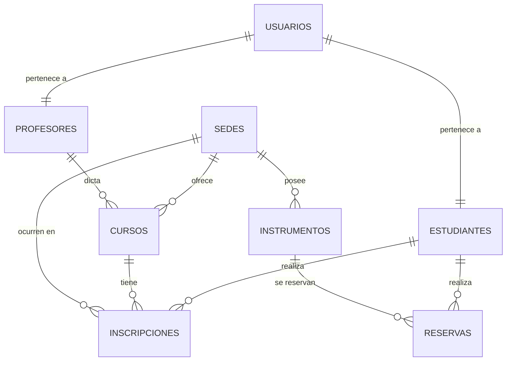

# Proyecto MongoDB 2 Alexi Duran y Esteban Mantilla
---
Docente. Pedro Felipe Gómez Bonilla // 24 - 10 - 2025

```mermaid

erDiagram
    USUARIOS ||--|| ESTUDIANTES : "pertenece a"
    USUARIOS ||--|| PROFESORES : "pertenece a"

    SEDES ||--o{ CURSOS : "ofrece"
    PROFESORES ||--o{ CURSOS : "dicta"
    ESTUDIANTES ||--o{ INSCRIPCIONES : "realiza"
    CURSOS ||--o{ INSCRIPCIONES : "tiene"
    SEDES ||--o{ INSCRIPCIONES : "ocurren en"

    ESTUDIANTES ||--o{ RESERVAS : "realiza"
    INSTRUMENTOS ||--o{ RESERVAS : "se reservan"

    SEDES ||--o{ INSTRUMENTOS : "posee"

```

- [Requerimientos](./ProyectoMongoDB2.md)

- [MongoDB Docs](https://www.mongodb.com/)