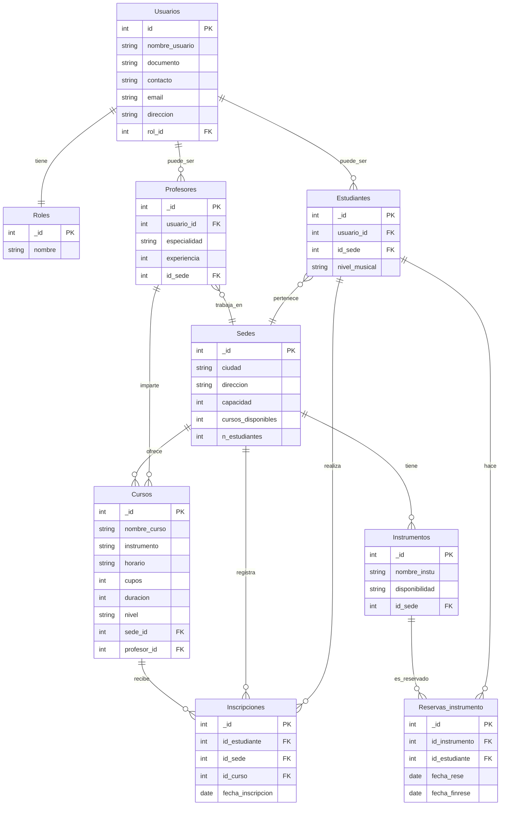

#### Proyecto MongoDB 2 Alexi Duran y Esteban Mantilla
Docente. Pedro Felipe Gómez Bonilla // 24 - 10 - 2025
---

# Campus Music - Sistema de Gestión de Escuelas de Música

**Proyecto MongoDB**

**Autor:** Alexi Durán Gómez y Esteban Mantilla

**Institución:** CAMPUSLANDS

**Ruta:** ARTEMIS - NODE

**Ubicación:** Bucaramanga, Santander

**Año:** 2025

---

## introducción
Este documento presenta la documentación completa del sistema de información desarrollado para **Campus Music**, una empresa que administra múltiples escuelas de música en diferentes ciudades de Colombia. El sistema ha sido diseñado para resolver los problemas actuales de gestión basada en hojas de cálculo, que generan duplicación de datos, inconsistencias y errores operativos.

El desarrollo de este sistema busca ser lo más óptimo posible mediante la implementación de las mejores prácticas de desarrollo con MongoDB, incluyendo:

- Validación de esquemas mediante JSON Schema
- Indexación estratégica para optimizar consultas
- Transacciones ACID para operaciones críticas
- Sistema de roles y permisos para seguridad granular
- Agregaciones avanzadas para reportes analíticos

### Objetivo del Sistema
Proporcionar una plataforma unificada que permita:

- Gestionar estudiantes, profesores, cursos y sedes de manera centralizada
- Controlar inscripciones con validación de cupos en tiempo real
- Administrar el préstamo de instrumentos musicales
- Generar reportes analíticos sobre ocupación, demanda y desempeño
- Implementar control de acceso basado en roles para diferentes tipos de usuarios

### Tecnología Utilizada
El sistema está desarrollado utilizando MongoDB, un sistema de gestión de bases de datos NoSQL orientado a documentos. MongoDB ha sido seleccionado por su flexibilidad, escalabilidad y capacidades avanzadas de agregación, que son ideales para el manejo de información heterogénea y consultas analíticas complejas.

## Caso de Estudio

**Campus Music** es una organización educativa dedicada a la enseñanza musical que opera en múltiples ciudades de Colombia (Bogotá, Medellín y Cali). La empresa enfrenta varios desafíos operativos:

### Problemática Actual
1. **Duplicación de Información:** Los datos de estudiantes, profesores y cursos se registran en hojas de cálculo separadas por sede, generando inconsistencias cuando un estudiante toma cursos en diferentes ubicaciones.

2. **Errores en Inscripciones:** La falta de validación automática de cupos disponibles ocasiona sobrecupos o inscripciones duplicadas.

3. **Dificultad en Reportes:** Generar estadísticas consolidadas sobre ocupación de cursos, desempeño de profesores o demanda de instrumentos requiere trabajo manual propenso a errores.

4. **Control de Acceso Inadecuado:** No existe un sistema formal de permisos, lo que permite que empleados de una sede accedan a información de otras sedes.

5. **Gestión de Instrumentos:** El control de préstamo de instrumentos musicales (guitarras, pianos, violines) se realiza manualmente sin trazabilidad.

### Solución Propuesta
Migrar a un sistema centralizado basado en MongoDB que:
Unifique la información de todas las sedes en una base de datos estructurada
Implemente validaciones automáticas de integridad y reglas de negocio
Proporcione transacciones para operaciones críticas como inscripciones
Ofrezca capacidades avanzadas de agregación para análisis y reportes
Implemente un sistema robusto de roles y permisos

## Justificación del Uso de MongoDB

La elección de MongoDB como base de datos para Campus Music se fundamenta en varios aspectos técnicos y funcionales:

### 1. Flexibilidad del Esquema

MongoDB permite almacenar documentos con estructuras variables, lo cual es ideal para:

- **Estudiantes con información diferente**: Algunos estudiantes son menores con datos de tutores, otros son adultos con información profesional
- **Cursos con características diversas**: Cursos grupales vs individuales, con diferentes duraciones, modalidades y requisitos
- **Evolución del sistema**: Agregar nuevos campos sin necesidad de migraciones complejas

### 2. Modelo de Documentos Orientado a Objetos

El formato JSON/BSON de MongoDB se alinea naturalmente con:

- La forma en que las aplicaciones modernas representan datos
- La necesidad de estructuras anidadas (ejemplo: dirección completa de una sede, horarios de cursos)
- La facilidad de integración con aplicaciones JavaScript/Node.js

### 3. Capacidades de Agregación Avanzadas

El framework de agregación de MongoDB permite:

- Realizar análisis complejos sin necesidad de múltiples queries
- Generar reportes consolidados de ocupación, ingresos y demanda
- Implementar pipelines de transformación de datos eficientes
- Calcular estadísticas en tiempo real

### 4. Transacciones ACID Multi-Documento

MongoDB soporta transacciones que garantizan:

- **Atomicidad**: Las inscripciones se completan totalmente o se revierten
- **Consistencia**: Los cupos siempre reflejan el estado real
- **Aislamiento**: Múltiples inscripciones simultáneas no generan conflictos
- **Durabilidad**: Los cambios confirmados persisten ante fallos

### 5. Sistema de Roles y Autenticación Integrado

MongoDB incluye:

- Control de acceso basado en roles (RBAC)
- Permisos granulares a nivel de colección y operación
- Autenticación integrada sin necesidad de componentes externos

### 6. Escalabilidad Horizontal

Aunque no es crítico en la fase inicial, MongoDB permite:

- Sharding para distribuir datos por múltiples servidores
- Réplicas para alta disponibilidad
- Crecimiento conforme Campus Music expande operaciones

### 7. Validación de Esquemas JSON Schema

MongoDB permite definir:

- Reglas de validación declarativas usando JSON Schema
- Tipos de datos específicos para cada campo
- Restricciones de negocio (valores permitidos, rangos, formatos)
- Validación automática en cada inserción/actualización

## Planificación

### Construcción del modelo conceptual

La construcción del modelo lógico de datos se desarrolló a partir del análisis funcional del sistema de gestión de escuelas de música, el cual busca centralizar la información relacionada con usuarios, profesores, estudiantes, cursos, sedes e instrumentos dentro de una misma estructura. Este modelo refleja la forma en que los datos se organizan y se relacionan entre sí, asegurando la coherencia y la integridad de la información. En el centro del modelo se encuentra la entidad Usuarios, que almacena los datos básicos de identificación, contacto y rol de cada persona dentro del sistema. A partir de esta entidad se establecen relaciones con otras tablas especializadas como Estudiantes y Profesores, las cuales amplían la información según el tipo de usuario. Los estudiantes cuentan con atributos específicos como el nivel musical y la sede a la que pertenecen, mientras que los profesores poseen campos adicionales como especialidad y experiencia.

### Descripción

El diseño del modelo de datos para Campus Music se basa en un análisis cuidadoso de las entidades del negocio y sus relaciones. Se ha optado por un modelo híbrido que combina referencias y documentos embebidos según el patrón de acceso y las necesidades de integridad.

**1. Usuarios**

Representa a todas las personas que interactúan con el sistema, incluyendo administradores, profesores, empleados y estudiantes. Contiene la información básica de identificación y contacto.
Atributos:

- id (PK): Identificador único del usuario.
- nombre_usuario: Nombre completo del usuario registrado.
- documento: Número de identificación personal.
- contacto: Número telefónico o medio de comunicación.
- email: Correo electrónico del usuario.
- direccion: Dirección de residencia o contacto.
- rol_id (FK): Rol asignado al usuario dentro del sistema.

Entidad principal que centraliza la información personal y establece la base de conexión con los diferentes tipos de usuarios del sistema.

---

**2. Roles**

Define los distintos tipos de permisos o niveles de acceso dentro de la plataforma, permitiendo diferenciar las funciones de cada usuario.
Atributos:

- id (PK): Identificador único del rol.
- nombre: Nombre del rol (Administrador, Empleado de sede, Estudiante, Profesor).

Entidad que permite gestionar los niveles de acceso y las responsabilidades de los usuarios en el sistema.

---

**3. Estudiantes**

Contiene la información específica de los alumnos inscritos en las escuelas de música, vinculándolos con su usuario base y con la sede a la que pertenecen.
Atributos:

- id (PK): Identificador único del estudiante.
- usuario_id (FK): Referencia al usuario asociado.
- nivel_musical: Nivel de conocimiento o experiencia musical del estudiante (básico, intermedio, avanzado).
- id_sede (FK): Sede en la que el estudiante se encuentra matriculado.

Entidad encargada de almacenar la información académica de los estudiantes y sus relaciones con los cursos, inscripciones y sedes.

---

**4. Profesores**

Registra los datos de los docentes que imparten los cursos en las diferentes sedes, relacionándolos con su usuario base.
Atributos:

- id (PK): Identificador único del profesor.
- usuario_id (FK): Usuario asociado al profesor.
- especialidad: Instrumento o área musical en la que el profesor se desempeña.
- experiencia: Años de experiencia o nivel profesional del docente.
- id_sede (FK): Sede en la que trabaja el profesor.

Entidad que representa al personal docente y permite vincularlos con los cursos y sedes correspondientes.

---

**5. Sedes**

Representa las distintas ubicaciones físicas donde opera Campus Music. Cada sede puede tener varios cursos, profesores y estudiantes.
Atributos:

- id (PK): Identificador único de la sede.
- ciudad: Ciudad donde se encuentra ubicada la sede.
- direccion: Dirección exacta del establecimiento.
- capacidad: Número máximo de estudiantes que puede atender la sede.
- cursos_disponibles: Cantidad de cursos activos en la sede.
- n_estudiantes: Número total de estudiantes registrados en la sede.

Entidad que organiza la distribución de recursos, cursos e instrumentos por ubicación geográfica.

---

**6. Cursos**

Contiene la información de los cursos ofrecidos en cada sede, incluyendo su relación con el profesor encargado y los estudiantes inscritos.
Atributos:

- id (PK): Identificador único del curso.
- nombre_curso: Nombre del curso (por ejemplo, Piano Básico, Guitarra Intermedia).
- instrumento: Instrumento principal que se enseña en el curso.
- horario: Horario de clases establecido.
- cupos: Cantidad máxima de estudiantes que pueden inscribirse.
- duracion: Duración total del curso (en semanas o meses).
- nivel: Nivel académico del curso (básico, intermedio, avanzado).
- sede_id (FK): Sede donde se imparte el curso.
- profesor_id (FK): Profesor responsable del curso.

Entidad fundamental que articula la enseñanza, permitiendo la relación entre estudiantes, profesores y sedes.

---

**7. Instrumentos**

Registra los instrumentos disponibles en cada sede para uso o préstamo de los estudiantes.
Atributos:

- id (PK): Identificador único del instrumento.
- nombre_instu: Nombre o tipo de instrumento (piano, guitarra, violín, etc.).
- disponibilidad: Estado del instrumento (disponible, reservado, en mantenimiento).
- id_sede (FK): Sede donde se encuentra el instrumento.

Entidad que permite gestionar los recursos físicos utilizados durante las clases o reservados por los estudiantes.

---

**8. Inscripciones**

Registra las inscripciones de los estudiantes a los cursos disponibles, permitiendo un control académico y administrativo de las matrículas.
Atributos:

- id (PK): Identificador único de la inscripción.
- id_estudiante (FK): Estudiante que realiza la inscripción.
- id_curso (FK): Curso al que el estudiante se inscribe.
- id_sede (FK): Sede donde se realiza la inscripción.
- fecha_inscripcion: Fecha en que se registró la matrícula.

Entidad transaccional que permite vincular estudiantes con cursos y sedes, registrando el proceso de matrícula.

---

**9. Reservas_instrumento**

Controla las reservas y préstamos de instrumentos realizados por los estudiantes, registrando las fechas y los elementos solicitados.
Atributos:

- id (PK): Identificador único de la reserva.
- id_instrumento (FK): Instrumento reservado.
- id_estudiante (FK): Estudiante que realiza la reserva.
- fecha_rese: Fecha de inicio de la reserva.
- fecha_finrese: Fecha de finalización del préstamo.

Entidad encargada de gestionar el préstamo de instrumentos musicales, manteniendo un control de disponibilidad y uso.

---

### Modelo Conceptual

### Descripción técnica

El modelo implementa una arquitectura relacional normalizada que utiliza identificadores únicos como claves primarias en todas las entidades, siguiendo la convención de nomenclatura _id. Las relaciones entre tablas se establecen mediante claves foráneas que garantizan la integridad referencial, permitiendo cascadas de eliminación o actualizaciones controladas según las reglas de negocio. La estructura sugiere el uso de índices en las claves foráneas para optimizar las consultas de tipo JOIN, especialmente en tablas transaccionales como Inscripciones y Reservas_instrumento que probablemente experimentarán alto volumen de operaciones de lectura y escritura.

El diseño presenta una mezcla de relaciones uno a muchos y muchos a muchos, estas últimas implementadas mediante tablas asociativas que incluyen atributos adicionales propios de la transacción. La entidad Sedes actúa como un hub relacional que conecta múltiples entidades, lo que podría representar un punto de optimización mediante vistas materializadas o cachés para consultas frecuentes sobre disponibilidad de recursos por ubicación. El campo n_estudiantes en Sedes sugiere una estrategia de desnormalización controlada que podría mantenerse actualizado mediante triggers o procedimientos almacenados que se ejecuten al insertar o eliminar registros en la tabla Estudiantes.

Las entidades Estudiantes y Profesores implementan un patrón de herencia o especialización sobre Usuarios mediante claves foráneas a usuario_id, lo que permite compartir atributos comunes mientras se mantienen características específicas de cada rol. Esta arquitectura facilita la extensibilidad del sistema si en el futuro se requieren tipos adicionales de usuarios con perfiles especializados. Las tablas transaccionales incluyen campos de tipo fecha que son críticos para auditoría y análisis temporal, sugiriendo que el sistema debe implementar validaciones a nivel de aplicación o mediante restricciones CHECK para garantizar coherencia en rangos de fechas, especialmente en Reservas_instrumento donde fecha_finrese debe ser posterior a fecha_rese.Retry

---

## Construcción del Modelo Lógico

La construcción del modelo lógico de datos se desarrolló a partir del análisis funcional del sistema de gestión de escuelas de música, el cual busca centralizar la información relacionada con usuarios, profesores, estudiantes, cursos, sedes e instrumentos dentro de una misma estructura. Este modelo refleja la forma en que los datos se organizan y se relacionan entre sí, asegurando la coherencia y la integridad de la información. En el centro del modelo se encuentra la entidad Usuarios, que almacena los datos básicos de identificación, contacto y rol de cada persona dentro del sistema. A partir de esta entidad se establecen relaciones con otras tablas especializadas como Estudiantes y Profesores, las cuales amplían la información según el tipo de usuario. Los estudiantes cuentan con atributos específicos como el nivel musical y la sede a la que pertenecen, mientras que los profesores poseen campos adicionales como especialidad y experiencia.

### Descripción

El modelo conceptual representa un sistema integral de gestión para una institución educativa musical que opera en múltiples sedes geográficas. El diseño se estructura alrededor de tres componentes fundamentales: la gestión de identidades y permisos mediante usuarios y roles, la administración académica que incluye cursos, profesores y estudiantes, y el control de recursos físicos representado por los instrumentos musicales. La arquitectura permite que la institución coordine eficientemente las operaciones entre sus diferentes ubicaciones mientras mantiene un sistema centralizado de información y control administrativo.

El sistema establece una clara jerarquía organizacional donde las sedes funcionan como núcleos operacionales que agrupan estudiantes, profesores, cursos e instrumentos. La separación entre usuarios genéricos y perfiles especializados como estudiantes y profesores permite una gestión flexible de identidades donde cada persona puede tener atributos específicos según su función dentro de la institución. Las entidades transaccionales como inscripciones y reservas de instrumentos capturan las interacciones dinámicas del ecosistema educativo, registrando cómo los estudiantes acceden a la oferta académica y a los recursos materiales necesarios para su formación musical, creando así un historial completo de la actividad institucional.

#### Descripción de las entidades

**1. Usuarios**

Representa a todas las personas que tienen acceso y participan en el sistema de gestión institucional.
Atributos:

- **_id (PK):** Identificador único de cada usuario registrado.
- **nombre_usuario:** Nombre completo de la persona.
- **documento:** Número de identificación oficial del usuario.
- **contacto:** Número telefónico para comunicación.
- **email:** Dirección de correo electrónico del usuario.
- **direccion:** Ubicación física o domicilio del usuario.
- **rol_id (FK):** Referencia al rol que determina permisos y funcionalidades.

Entidad base del sistema de autenticación que centraliza la información personal de todos los actores del sistema.

---

**2. Roles**

Define los diferentes perfiles de acceso y niveles de autorización dentro del sistema.
Atributos:

- **_id (PK):** Identificador único del rol.
- **nombre:** Denominación descriptiva del rol (administrador, docente, alumno, etc.).

Entidad de configuración que implementa el modelo de seguridad basado en roles para controlar accesos y permisos.

---

**3. Sedes**

Representa las ubicaciones físicas donde la institución musical tiene presencia operativa.
Atributos:

- **_id (PK):** Identificador único de cada sede.
- **ciudad:** Ciudad donde está ubicada la instalación.
- **direccion:** Dirección postal completa de la sede.
- **capacidad:** Límite máximo de estudiantes que puede atender.
- **cursos_disponibles:** Listado de programas educativos ofrecidos.
- **n_estudiantes:** Contador de estudiantes actualmente matriculados.

Entidad organizacional principal que distribuye geográficamente la operación y los recursos de la institución.

---

**4. Estudiantes**

Representa a los alumnos matriculados que cursan programas de formación musical.
Atributos:

- **_id (PK):** Identificador único del estudiante.
- **usuario_id (FK):** Vinculación con el registro de usuario correspondiente.
- **nivel_musical:** Clasificación del grado de competencia o avance musical.
- **id_sede (FK):** Sede principal de adscripción del estudiante.

Entidad especializada que extiende la información de usuarios con atributos académicos específicos del perfil estudiantil.

---

**5. Profesores**

Representa al personal docente encargado de impartir la formación musical.
Atributos:

- **_id (PK):** Identificador único del profesor.
- **usuario_id (FK):** Vinculación con el registro de usuario del docente.
- **especialidad:** Instrumento o área musical de expertise del profesor.
- **experiencia:** Medida de años o nivel de trayectoria profesional.
- **id_sede (FK):** Sede a la cual está asignado el profesor.

Entidad que gestiona la información del cuerpo académico y su distribución entre las diferentes sedes.

---

**6. Cursos**

Representa los programas educativos y clases que conforman la oferta académica institucional.
Atributos:

- **_id (PK):** Identificador único del curso.
- **nombre_curso:** Título descriptivo del programa educativo.
- **instrumento:** Instrumento musical principal del curso.
- **horario:** Programación de días y horas de las sesiones.
- **cupos:** Número máximo de estudiantes admitidos.
- **duracion:** Extensión temporal del programa completo.
- **nivel:** Grado de dificultad o prerrequisitos del curso.
- **sede_id (FK):** Sede donde se imparte el curso.
- **profesor_id (FK):** Docente responsable del curso.

Entidad nuclear de la oferta educativa que vincula profesores, estudiantes y sedes en programas estructurados.

---

**7. Instrumentos**

Representa el inventario de instrumentos musicales disponibles para uso de los estudiantes.
Atributos:

- **_id (PK):** Identificador único de cada instrumento.
- **nombre_instu:** Tipo o clasificación del instrumento musical.
- **disponibilidad:** Estado actual del recurso (libre, ocupado, mantenimiento).
- **id_sede (FK):** Sede donde está físicamente ubicado el instrumento.

Entidad de gestión patrimonial que controla los recursos instrumentales distribuidos en las instalaciones.

--- 

**8. Inscripciones**

Registra las matrículas formales de estudiantes en los cursos ofrecidos.
Atributos:

- **_id (PK):** Identificador único de cada registro de inscripción.
- **id_estudiante (FK):** Estudiante que formaliza la matrícula.
- **id_sede (FK):** Sede donde se procesa la inscripción.
- **id_curso (FK):** Curso al cual se inscribe el estudiante.
- **fecha_inscripcion:** Timestamp del registro de la matrícula.

Entidad asociativa que materializa la relación muchos a muchos entre estudiantes y cursos, creando el historial académico.

---

**9. Reservas_instrumento**

Gestiona el sistema de préstamos temporales de instrumentos a estudiantes.
Atributos:

- **_id (PK):** Identificador único de cada reserva.
- **id_instrumento (FK):** Instrumento que se asigna en préstamo.
- **id_estudiante (FK):** Estudiante beneficiario del préstamo.
- **fecha_rese:** Fecha de inicio del periodo de préstamo.
- **fecha_finrese:** Fecha programada de devolución del instrumento.

Entidad transaccional que controla el acceso compartido y temporal de estudiantes a los recursos instrumentales institucionales.

---

### Modelo Lógico

### Descripción Técnica

El modelo implementa una arquitectura relacional normalizada que utiliza claves primarias artificiales con la convención _id en todas las entidades, garantizando unicidad independiente de los atributos naturales. Las relaciones entre tablas se materializan mediante claves foráneas que implementan restricciones de integridad referencial, asegurando consistencia en las asociaciones entre entidades. La estructura sugiere el uso estratégico de índices compuestos en las tablas transaccionales, particularmente en Inscripciones donde las consultas frecuentemente filtrarán por combinaciones de id_estudiante, id_curso e id_sede para verificar matrículas específicas o generar reportes de ocupación.

El diseño presenta una arquitectura hub-and-spoke donde Sedes actúa como entidad central que conecta múltiples subsistemas del modelo, lo que implica que la mayoría de las consultas complejas involucrarán joins directos o indirectos con esta tabla. Esta centralidad podría representar un cuello de botella en sistemas con alta concurrencia, sugiriendo la necesidad de estrategias de particionamiento horizontal por sede o el uso de réplicas de lectura para distribución de carga. El campo n_estudiantes en Sedes indica una desnormalización intencional que probablemente se mantiene mediante triggers AFTER INSERT/DELETE en la tabla Estudiantes o mediante jobs programados que recalculan estos contadores periódicamente.

Las entidades Estudiantes y Profesores implementan un patrón de extensión de tabla mediante usuario_id, creando una jerarquía donde los atributos comunes residen en Usuarios mientras los específicos se distribuyen en tablas especializadas. Esta arquitectura facilita la implementación de single sign-on y permite consultas eficientes de información básica sin necesidad de joins cuando solo se requieren datos del usuario. Las tablas asociativas Inscripciones y Reservas_instrumento incluyen campos temporales críticos que requieren validaciones a nivel de base de datos mediante constraints CHECK para garantizar coherencia temporal, asegurando que las fechas de inicio precedan a las de finalización y que no existan solapamientos en reservas del mismo instrumento mediante triggers BEFORE INSERT/UPDATE que verifiquen conflictos de disponibilidad.

- [Requerimientos](./ProyectoMongoDB2.md)

- [MongoDB Docs](https://www.mongodb.com/)