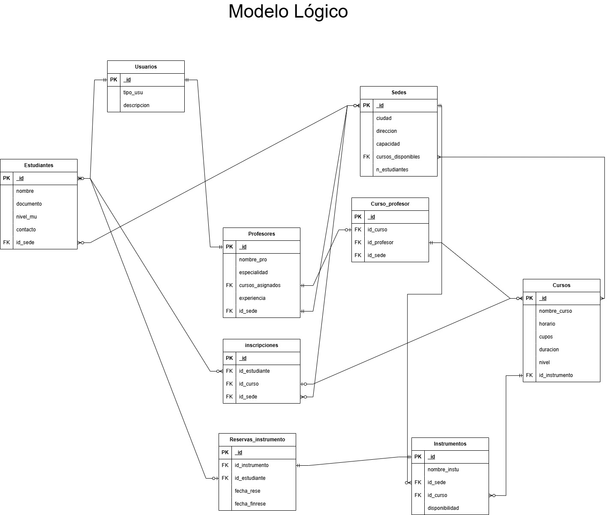

Campus music

# 

**Esteban Mantilla y Alexi Duran**

**S2**

**PEDRO FELIPE GÓMEZ BONILLA**

**CAMPUSLANDS**  
**Cajasan**  
**RUTA NODE**  
**Puerta del sol**  
**2025**

Tabla de Contenidos

[**Introducción	4**](#introducción)

[**Caso de Estudio	5**](#caso-de-estudio)

[**Planificación	5**](#planificación)

[Construcción del Modelo Conceptual	5](#construcción-del-modelo-conceptual)

[Descripción	5](#descripción)

[Gráfica	5](#gráfica)

[Descripción Técnica	6](#descripción-técnica)

[Construcción del Modelo Lógico	6](#construcción-del-modelo-lógico)

[Descripción	6](#descripción-1)

[Gráfica](#gráfica-1)	[6](#heading=h.iteillbur6a0)

[Normalización del Modelo Lógico	6](#normalización-del-modelo-lógico)

[Primera Forma Normal (1FN)](#primera-forma-normal-\(1fn\))	[7](#heading=h.wfqqgxfwbqd7)

[Gráfica	7](#gráfica-2)

[Descripción Técnica	7](#descripción-técnica-1)

[Segunda Forma Normal (2FN)	7](#segunda-forma-normal-\(2fn\))

[Descripción	8](#descripción-2)

[Gráfica	8](#gráfica-3)

[Descripción Técnica	8](#descripción-técnica-2)

[Tercera Forma Normal (3FN)](#tercera-forma-normal-\(3fn\))	[8](#heading=h.ilnoj6xzrjw8)

[Gráfica	8](#gráfica-4)

[Descripción Técnica	8](#descripción-técnica-3)

[Construcción del Modelo Físico	9](#construcción-del-modelo-físico)

[Descripción	9](#descripción-3)

[Código	9](#código)

[Descripción Técnica](#descripción-técnica-4)	[12](#heading=h.r410ylspi4mo)

[**Referencias	13**](#referencias)

# Introducción {#introducción}

El presente documento ha sido elaborado con el propósito de mostrar el diseño del sistema de información para la gestión, análisis y consulta de datos de las escuelas de musica de la empresa Campus music, basado en la información suministrada.
Este trabajo se desarrolla por medio Esteban Mantila y Alexi Durán Gómez, con el fin de aplicar los conocimientos adquiridos en el diseño, modelado y estructuración de bases de datos, utilizando MongoDB como sistema gestor de base de datos NoSQL referenciado.
La documentación presenta de manera ordenada el proceso completo de diseño del sistema, abarcando desde la conceptualización inicial del modelo de datos hasta su implementación física en MongoDB. Se incluyen las etapas de planificación, diseño conceptual, modelo lógico, normalización y definición de las colecciones, así como ejemplos de inserción y consultas de información.
El sistema busca ofrecer una estructura sólida y escalable que permita almacenar, organizar y consultar información sobre las escuelas de musica, facilitando su análisis por sede, curso, Zona, roles etc...
El uso de MongoDB como tecnología base responde a la necesidad de manejar grandes volúmenes de datos estructurados y semiestructurados de forma flexible, permitiendo almacenar documentos con distintos niveles de detalle y adaptarse a la naturaleza heterogénea de los registros educativos.
Este enfoque proporciona una visión moderna y eficiente para la administración de datos educativos, favoreciendo su integración con aplicaciones web y sistemas de análisis en tiempo real.

# Caso de Estudio {#caso-de-estudio}

**Campus Music** es una empresa que administra múltiples escuelas de música en diferentes ciudades.

Actualmente, usan hojas de cálculo para registrar estudiantes, profesores, cursos e inscripciones, lo que causa duplicación de datos y errores.

Han decidido migrar a **MongoDB** para mejorar la flexibilidad, manejar la información de manera unificada, y soportar operaciones transaccionales en inscripciones. Tu rol será diseñar esta solución, poblarla con datos realistas, implementar consultas analíticas, definir roles de seguridad y demostrar el uso de transacciones.

## Requisitos funcionales del sistema

### Funcionalidad esperada

El sistema debe permitir:

- Registro de **estudiantes** (nombre, documento, contacto, nivel musical).
- Registro de **profesores** (especialidad, experiencia, cursos asignados).
- Registro de **cursos** (instrumento, nivel, duración, cupos, horario).
- Registro de **sedes** (ciudad, dirección, capacidad, cursos disponibles).
- Gestión de **usuarios** con roles:
- **Administrador**: acceso total.
- **Empleado de sede**: acceso limitado a la sede.
- **Estudiante**: acceso a su información, inscripción y consulta de cursos disponibles.
- **Inscripción de estudiantes** en cursos:
- Validar cupos disponibles.
- tener en cuenta costo y fechaInscripcion.
- Asociar estudiante con curso, sede y profesor.
- Actualizar cupo automáticamente mediante transacción.
- **Reservas de instrumentos** por parte de estudiantes (ej: piano, guitarra, violín).
- Reportes y consultas analíticas:
- Ocupación de cursos por sede.
- Cursos más demandados.
- Profesores con más estudiantes asignados.
- Instrumentos más reservados.
- Histórico de cursos tomados por cada estudiante.

# Planificación {#planificación}
Esté modelo de Base de datos busca estar bien estructurado y seguir con coherencia el enfoque relacional dentro de MongoDB, también conocido como modelo referenciado híbrido, que busca mantener integridad y consistencia usando referencias entre colecciones  en lugar de anidar demasiados documentos, ya que esto evita la duplicidad y mantiene el control sobre la estructura (ideal ya que conocemos que se poseen esos errores en el sistema de informacion anterior).

Entonces se sigue la filosofía SQL aplicada a MongoDB y su sistema NoSQL, conservando el diseño relacional con entidades independientes y relaciones 1:N o N:M por referencia.
Basado en los diagramas que se crearon para graficar el diseño y el dataset.

## Construcción del Modelo Conceptual {#construcción-del-modelo-conceptual}

Un modelo conceptual es una representación de un sistema, hecho de la composición de conceptos que se utilizan para ayudar a las personas a conocer, comprender o simular un tema que representa el modelo, incluye las entidades importantes y las relaciones entre ellos. También es un conjunto de conceptos.

### Descripción {#descripción}

Modelo de entidad relacion donde se relaciona entidades importantes como , el Estudiante , el nivel, el curso.

### Gráfica {#gráfica}

### Descripción Técnica {#descripción-técnica}

El modelo conceptual establece las siguientes relaciones entre entidades, de acuerdo con el diagrama proporcionado: ● Estudiantes – Cursos (N:M): Un curso puede contener múltiples estudiantes, mientras que cada estudiante pertenece a uno o varios cursos. ● MUNICIPIO – SEDE (1:N): Cada municipio está asociado a una única sede, representada por coordenadas específicas. ● SEDE – ESTUDIANTES (1:N): Una sede puede estar relacionado con múltiples estudiantes, mientras que cada estudiate está vinculada a una única sede. ● ESTUDIANTE – SEDE (1:1): Un estudiante puede estar asociado a una sola víctima y cada víctima pertenece a un único estudiante.

## Construcción del Modelo Lógico {#construcción-del-modelo-lógico}

Los modelos son descripciones hipotéticas de la cadena de causas y efectos que conducen a un resultado de interés. Si bien pueden estar en forma narrativa, el modelo lógico generalmente toma forma en una representación gráfica de las relaciones "si-entonces" entre los diversos elementos que conducen al resultado.

### Descripción {#descripción-1}

Se traducen las entidades en tablas, los atributos en columnas y se definen claves primarias y foráneas.

### Gráfica {#gráfica-1}

## Normalización del Modelo Lógico {#normalización-del-modelo-lógico}

### Primera Forma Normal (1FN) {#primera-forma-normal-(1fn)}

La primera forma normal es forma normal usada en normalización de bases de datos. Una tabla de base de datos relacional que se adhiere a la 1FN es una que satisface cierto conjunto mínimo de criterios.

#### Gráfica {#gráfica-2}

#### Descripción Técnica {#descripción-técnica-1}

Los atributos son atómicos (no hay grupos repetitivos ni multivalorados). Cumple

### Segunda Forma Normal (2FN) {#segunda-forma-normal-(2fn)}

La segunda forma normal es una forma normal usada en normalización de bases de datos. La 2NF fue definida originalmente por E.F. Codd​ en 1971\. Una tabla que está en la primera forma normal debe satisfacer criterios adicionales para calificar para la segunda forma normal.

#### Descripción {#descripción-2}

 Existe una clave primaria candidata,Todos los atributos no clave, dependen completamente de la clave primaria. Cumple

#### Gráfica {#gráfica-3}

#### Descripción Técnica {#descripción-técnica-2}

No hay dependencias transitivas .

### Tercera Forma Normal (3FN) {#tercera-forma-normal-(3fn)}

La tercera forma normal es una forma normal usada en la normalización de bases de datos. La 3NF fue definida originalmente por E.F. Codd​ en 1971\. La definición de Codd indica que una tabla está en 3NF si y solo si las dos condiciones siguientes se cumplen: La tabla está en la segunda forma normal.

#### Gráfica {#gráfica-4}

#### Descripción Técnica {#descripción-técnica-3}

No hay dependencias transitivas

## Construcción del Modelo Físico {#construcción-del-modelo-físico}

Un modelo físico puede referirse a una construcción teórica de un sistema físico. También a un montaje con objetos reales que reproducen el comportamiento de algunos aspectos de un sistema físico o mecánico más complejo a diferente escala..

### Descripción {#descripción-3}

El modelo físico define cómo se implementarán las tablas y relaciones en el sistema gestor de  
base de datos. Cada tabla se define en lenguaje NoSQL incluyendo claves primarias y foráneas, y  
tipos de datos.

### Código {#código}

use  victimasminas;  
db.createCollection(Departamento);  
db.Departamento.insertOne({  
“nombre\_de”:””,  
“id\_deparDaen”:””  
});

db.createCollection(Municipio);  
db.Municipio.insertOne(“id\_muni”:””,  
“nombre\_muni”:””,  
“idMunicipioDane”:””,  
“id\_departamento”:””,  
);

  

### Descripción Técnica {#descripción-técnica-4}

Las tablas mostradas como se puede evidenciar son creadas con toda la estructura creada y lista para el desarrollador a futuro para las consultas y el almacenamiento de la data de manera eficiente podiendo mostrar datos de otras tablas por medio de las conexiones entre cada una de ellas.

# Referencias {#referencias}

