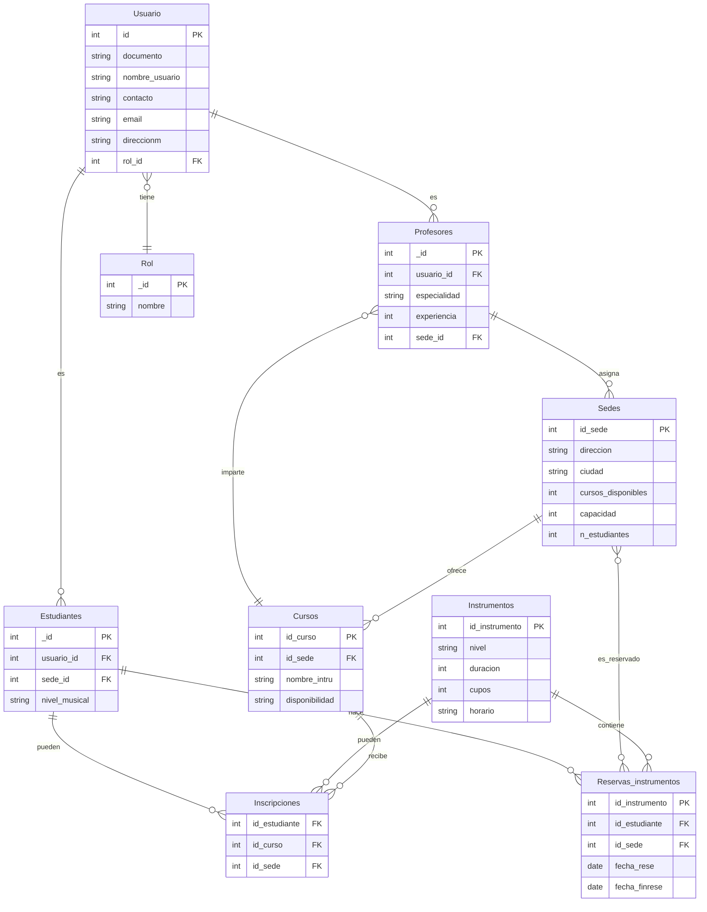
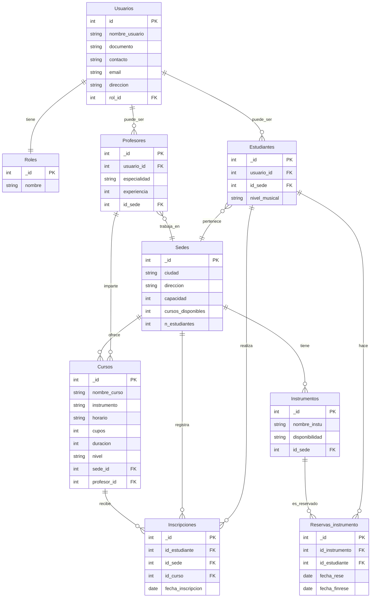

# Campus Music - Sistema de Gestión de Escuelas de Música

**Proyecto MongoDB**

**Autor:** Alexi Durán Gómez y Esteban Mantilla

**Institución:** CAMPUSLANDS

**Ruta:** ARTEMIS - NODE

**Ubicación:** Bucaramanga, Santander

**Año:** 2025

## Tabla de Contenidos

1. [Introducción](#introducción)
2. [Caso de Estudio](#caso-de-estudio)
3. [Justificación del Uso de MongoDB](#justificación-del-uso-de-mongodb)
4. [Diseño del Modelo de Datos](#diseño-del-modelo-de-datos)
   - [Colecciones Creadas](#colecciones-creadas)
   - [Decisiones de Diseño: Referencias vs Embebidos](#decisiones-de-diseño-referencias-vs-embebidos)
   - [Diagrama del Modelo de Datos](#diagrama-del-modelo-de-datos)
5. [Validaciones JSON Schema](#validaciones-json-schema)
   - [Explicación por Colección](#explicación-por-colección)
6. [Índices](#índices)
   - [Lista de Índices Creados](#lista-de-índices-creados)
   - [Justificación Técnica](#justificación-técnica)
7. [Estructura de Datos de Prueba](#estructura-de-datos-de-prueba)
8. [Consultas Analíticas (Agregaciones)](#consultas-analíticas-agregaciones)
9. [Sistema de Transacciones](#sistema-de-transacciones)
   - [Escenario Utilizado](#escenario-utilizado)
   - [Código Explicado Paso a Paso](#código-explicado-paso-a-paso)
10. [Sistema de Roles y Seguridad](#sistema-de-roles-y-seguridad)
    - [Descripción de Cada Rol](#descripción-de-cada-rol)
    - [Ejemplos de Creación de Usuarios](#ejemplos-de-creación-de-usuarios)
11. [Conclusiones y Mejoras Posibles](#conclusiones-y-mejoras-posibles)
12. [Referencias](#referencias)

---

## Introducción

Este documento presenta la documentación completa del sistema de información desarrollado para **Campus Music**, una empresa que administra múltiples escuelas de música en diferentes ciudades de Colombia. El sistema ha sido diseñado para resolver los problemas actuales de gestión basada en hojas de cálculo, que generan duplicación de datos, inconsistencias y errores operativos.

El desarrollo de este sistema busca ser lo más óptimo posible mediante la implementación de las mejores prácticas de desarrollo con MongoDB, incluyendo:

- **Validación de esquemas** mediante JSON Schema
- **Indexación estratégica** para optimizar consultas
- **Transacciones ACID** para operaciones críticas
- **Sistema de roles y permisos** para seguridad granular
- **Agregaciones avanzadas** para reportes analíticos

### Objetivo del Sistema

Proporcionar una plataforma unificada que permita:

- Gestionar estudiantes, profesores, cursos y sedes de manera centralizada
- Controlar inscripciones con validación de cupos en tiempo real
- Administrar el préstamo de instrumentos musicales
- Generar reportes analíticos sobre ocupación, demanda y desempeño
- Implementar control de acceso basado en roles para diferentes tipos de usuarios

### Tecnología Utilizada

El sistema está desarrollado utilizando **MongoDB**, un sistema de gestión de bases de datos NoSQL orientado a documentos. MongoDB ha sido seleccionado por su flexibilidad, escalabilidad y capacidades avanzadas de agregación, que son ideales para el manejo de información heterogénea y consultas analíticas complejas.

---

## Caso de Estudio

**Campus Music** es una organización educativa dedicada a la enseñanza musical que opera en múltiples ciudades de Colombia (Bogotá, Medellín y Cali). La empresa enfrenta varios desafíos operativos:

### Problemática Actual

1. **Duplicación de Información**: Los datos de estudiantes, profesores y cursos se registran en hojas de cálculo separadas por sede, generando inconsistencias cuando un estudiante toma cursos en diferentes ubicaciones.

2. **Errores en Inscripciones**: La falta de validación automática de cupos disponibles ocasiona sobrecupos o inscripciones duplicadas.

3. **Dificultad en Reportes**: Generar estadísticas consolidadas sobre ocupación de cursos, desempeño de profesores o demanda de instrumentos requiere trabajo manual propenso a errores.

4. **Control de Acceso Inadecuado**: No existe un sistema formal de permisos, lo que permite que empleados de una sede accedan a información de otras sedes.

5. **Gestión de Instrumentos**: El control de préstamo de instrumentos musicales (guitarras, pianos, violines) se realiza manualmente sin trazabilidad.

### Solución Propuesta

Migrar a un sistema centralizado basado en MongoDB que:

- Unifique la información de todas las sedes en una base de datos estructurada
- Implemente validaciones automáticas de integridad y reglas de negocio
- Proporcione transacciones para operaciones críticas como inscripciones
- Ofrezca capacidades avanzadas de agregación para análisis y reportes
- Implemente un sistema robusto de roles y permisos

---

## Justificación del Uso de MongoDB

La elección de MongoDB como base de datos para Campus Music se fundamenta en varios aspectos técnicos y funcionales:

### 1. Flexibilidad del Esquema

MongoDB permite almacenar documentos con estructuras variables, lo cual es ideal para:

- **Estudiantes con información diferente**: Algunos estudiantes son menores con datos de tutores, otros son adultos con información profesional
- **Cursos con características diversas**: Cursos grupales vs individuales, con diferentes duraciones, modalidades y requisitos
- **Evolución del sistema**: Agregar nuevos campos sin necesidad de migraciones complejas

### 2. Modelo de Documentos Orientado a Objetos

El formato JSON/BSON de MongoDB se alinea naturalmente con:

- La forma en que las aplicaciones modernas representan datos
- La necesidad de estructuras anidadas (ejemplo: dirección completa de una sede, horarios de cursos)
- La facilidad de integración con aplicaciones JavaScript/Node.js

### 3. Capacidades de Agregación Avanzadas

El framework de agregación de MongoDB permite:

- Realizar análisis complejos sin necesidad de múltiples queries
- Generar reportes consolidados de ocupación, ingresos y demanda
- Implementar pipelines de transformación de datos eficientes
- Calcular estadísticas en tiempo real

### 4. Transacciones ACID Multi-Documento

MongoDB soporta transacciones que garantizan:

- **Atomicidad**: Las inscripciones se completan totalmente o se revierten
- **Consistencia**: Los cupos siempre reflejan el estado real
- **Aislamiento**: Múltiples inscripciones simultáneas no generan conflictos
- **Durabilidad**: Los cambios confirmados persisten ante fallos

### 5. Sistema de Roles y Autenticación Integrado

MongoDB incluye:

- Control de acceso basado en roles (RBAC)
- Permisos granulares a nivel de colección y operación
- Autenticación integrada sin necesidad de componentes externos

### 6. Escalabilidad Horizontal

Aunque no es crítico en la fase inicial, MongoDB permite:

- Sharding para distribuir datos por múltiples servidores
- Réplicas para alta disponibilidad
- Crecimiento conforme Campus Music expande operaciones

### 7. Validación de Esquemas JSON Schema

MongoDB permite definir:

- Reglas de validación declarativas usando JSON Schema
- Tipos de datos específicos para cada campo
- Restricciones de negocio (valores permitidos, rangos, formatos)
- Validación automática en cada inserción/actualización

### Comparación con Alternativas

| Característica | MongoDB | SQL Relacional | Razón de Elección |
|----------------|---------|----------------|-------------------|
| Flexibilidad de esquema | Alta | Baja | Información heterogénea de cursos y estudiantes |
| Agregaciones complejas | Excelente | Bueno | Reportes analíticos frecuentes |
| Transacciones | Sí | Sí | Ambos soportan, pero MongoDB simplifica el modelo |
| Escalabilidad horizontal | Nativa | Compleja | Preparación para crecimiento futuro |
| Documentos anidados | Nativo | Requiere JOINs | Reduce complejidad de queries |

---

## Diseño del Modelo de Datos

El diseño del modelo de datos para Campus Music se basa en un análisis cuidadoso de las entidades del negocio y sus relaciones. Se ha optado por un modelo híbrido que combina referencias y documentos embebidos según el patrón de acceso y las necesidades de integridad.

### Colecciones Creadas

El sistema está compuesto por 8 colecciones principales:

#### 1. **usuarios**

Almacena información de todos los usuarios del sistema con capacidad de login.

**Propósito**: Gestionar autenticación y autorización

**Campos principales**:
- `_id`: ObjectId único
- `username`: Nombre de usuario único
- `password`: Hash de contraseña (bcrypt)
- `rol`: Tipo de usuario (administrador, empleado_sede, estudiante)
- `sede_id`: Referencia a sede (solo para empleados)
- `estudiante_id`: Referencia a estudiante (solo para rol estudiante)
- `activo`: Estado del usuario
- `fecha_creacion`: Timestamp de registro

#### 2. **estudiantes**

Registra información personal y académica de los estudiantes.

**Propósito**: Gestionar datos de estudiantes y su nivel musical

**Campos principales**:
- `_id`: ObjectId único
- `documento`: Identificación única del estudiante
- `tipo_documento`: CC, TI, CE, Pasaporte
- `nombre_completo`: String
- `fecha_nacimiento`: Date
- `contacto`: Objeto embebido (email, telefono, direccion)
- `nivel_musical`: basico, intermedio, avanzado
- `fecha_registro`: Timestamp

#### 3. **profesores**

Información de los profesores y sus especialidades.

**Propósito**: Gestionar datos de profesores y asignación de cursos

**Campos principales**:
- `_id`: ObjectId único
- `documento`: Identificación única
- `nombre_completo`: String
- `especialidades`: Array de instrumentos/áreas
- `años_experiencia`: Number
- `contacto`: Objeto embebido
- `cursos_asignados`: Array de referencias a cursos
- `activo`: Boolean

#### 4. **sedes**

Información de las ubicaciones físicas de Campus Music.

**Propósito**: Gestionar información de sedes y su capacidad

**Campos principales**:
- `_id`: ObjectId único
- `nombre`: String único
- `ciudad`: String
- `direccion`: Objeto embebido (calle, barrio, coordenadas)
- `capacidad_maxima`: Number
- `telefono`: String
- `email`: String
- `horario_atencion`: Objeto embebido
- `activa`: Boolean

#### 5. **cursos**

Catálogo de cursos ofrecidos con sus características.

**Propósito**: Gestionar oferta académica y control de cupos

**Campos principales**:
- `_id`: ObjectId único
- `nombre`: String
- `instrumento`: guitarra, piano, violin, etc.
- `nivel`: basico, intermedio, avanzado
- `sede_id`: Referencia a sede
- `profesor_id`: Referencia a profesor
- `duracion_semanas`: Number
- `cupos_totales`: Number
- `cupos_disponibles`: Number
- `horario`: Objeto embebido (dias, hora_inicio, hora_fin)
- `costo`: Number
- `fecha_inicio`: Date
- `fecha_fin`: Date
- `activo`: Boolean

#### 6. **inscripciones**

Registro de inscripciones de estudiantes en cursos.

**Propósito**: Relacionar estudiantes con cursos y gestionar historial

**Campos principales**:
- `_id`: ObjectId único
- `estudiante_id`: Referencia a estudiante
- `curso_id`: Referencia a curso
- `sede_id`: Referencia a sede (desnormalizado para queries)
- `profesor_id`: Referencia a profesor (desnormalizado)
- `fecha_inscripcion`: Date
- `costo`: Number (desnormalizado)
- `estado`: activa, completada, cancelada
- `calificacion_final`: Number (opcional)
- `observaciones`: String (opcional)

#### 7. **instrumentos**

Inventario de instrumentos disponibles para préstamo.

**Propósito**: Gestionar inventario de instrumentos

**Campos principales**:
- `_id`: ObjectId único
- `tipo`: guitarra, piano, violin, etc.
- `marca`: String
- `modelo`: String
- `numero_serie`: String único
- `sede_id`: Referencia a sede donde está ubicado
- `estado`: excelente, bueno, regular, mantenimiento
- `disponible`: Boolean
- `fecha_adquisicion`: Date
- `valor_estimado`: Number

#### 8. **reservas_instrumentos**

Registro de préstamos de instrumentos a estudiantes.

**Propósito**: Controlar préstamos y devoluciones

**Campos principales**:
- `_id`: ObjectId único
- `estudiante_id`: Referencia a estudiante
- `instrumento_id`: Referencia a instrumento
- `sede_id`: Referencia a sede
- `fecha_reserva`: Date
- `fecha_devolucion_programada`: Date
- `fecha_devolucion_real`: Date (opcional)
- `estado`: activa, completada, vencida
- `observaciones`: String (opcional)

### Decisiones de Diseño: Referencias vs Embebidos

Una de las decisiones más importantes en el diseño de bases de datos MongoDB es determinar cuándo usar documentos embebidos y cuándo usar referencias. Aquí se explican las decisiones tomadas:

#### Uso de Referencias (Normalización)

**Se utilizaron referencias en los siguientes casos:**

1. **Relaciones Uno a Muchos con Entidades Independientes**
   - Ejemplo: `cursos.profesor_id` → `profesores._id`
   - **Razón**: Un profesor puede tener múltiples cursos, pero los profesores tienen ciclo de vida independiente

2. **Evitar Duplicación de Datos Grandes**
   - Ejemplo: `inscripciones.estudiante_id` → `estudiantes._id`
   - **Razón**: Los datos completos del estudiante son extensos y se consultan en diferentes contextos

3. **Relaciones Muchos a Muchos**
   - Ejemplo: Estudiantes e Instrumentos a través de `reservas_instrumentos`
   - **Razón**: Necesidad de colección intermedia para metadatos de la relación

4. **Integridad Referencial Importante**
   - Ejemplo: `cursos.sede_id` → `sedes._id`
   - **Razón**: Cambios en sede deben reflejarse en todos los cursos

#### Uso de Documentos Embebidos

**Se embebieron documentos en los siguientes casos:**

1. **Datos que Siempre se Consultan Juntos**
   - Ejemplo: `estudiantes.contacto` (email, telefono, dirección)
   - **Razón**: Siempre necesitamos el contacto completo cuando consultamos un estudiante

2. **Datos de Tamaño Limitado**
   - Ejemplo: `cursos.horario` (dias, hora_inicio, hora_fin)
   - **Razón**: Estructura pequeña y fija que no crece

3. **Relaciones de Composición (Parte-Todo)**
   - Ejemplo: `sedes.direccion` (calle, barrio, ciudad, coordenadas)
   - **Razón**: La dirección no tiene sentido sin la sede

4. **Mejora de Performance en Queries Frecuentes**
   - Ejemplo: Horarios embebidos en cursos
   - **Razón**: Evita JOINs en queries de búsqueda de cursos por horario

#### Desnormalización Estratégica

**Campos duplicados intencionalmente:**

1. **`inscripciones.costo`**
   - También existe en `cursos.costo`
   - **Razón**: Preservar el precio histórico al momento de inscripción (los precios pueden cambiar)

2. **`inscripciones.sede_id` y `inscripciones.profesor_id`**
   - También existen en `cursos`
   - **Razón**: Acelerar agregaciones que agrupan por sede o profesor sin necesidad de lookup

3. **`profesores.cursos_asignados`**
   - También se puede obtener consultando `cursos.profesor_id`
   - **Razón**: Consulta rápida de carga laboral del profesor

#### Tabla de Decisiones

| Relación | Estrategia | Justificación |
|----------|-----------|---------------|
| Estudiante - Contacto | Embebido | Datos siempre consultados juntos |
| Curso - Sede | Referencia | Sedes son entidades independientes |
| Curso - Profesor | Referencia | Profesores tienen ciclo de vida propio |
| Estudiante - Cursos | Colección intermedia (inscripciones) | Relación M:N con metadatos |
| Sede - Dirección | Embebido | Composición, no existe independientemente |
| Inscripción - Costo | Desnormalizado | Necesidad histórica |

### Diagrama del Modelo de Datos

```
┌─────────────────┐         ┌─────────────────┐
│   USUARIOS      │         │   ESTUDIANTES   │
├─────────────────┤         ├─────────────────┤
│ _id             │◆───────▷│ _id             │
│ username        │         │ documento       │
│ password        │         │ nombre_completo │
│ rol             │         │ contacto {}     │
│ estudiante_id   │         │ nivel_musical   │
│ sede_id         │         └─────────────────┘
└─────────────────┘                  △
         │                           │
         │                           │
         ▽                           │
┌─────────────────┐         ┌───────┴─────────┐
│     SEDES       │         │  INSCRIPCIONES  │
├─────────────────┤         ├─────────────────┤
│ _id             │◁────────│ estudiante_id   │
│ nombre          │         │ curso_id        │
│ ciudad          │         │ sede_id         │
│ direccion {}    │         │ profesor_id     │
│ capacidad       │         │ fecha           │
└─────────────────┘         │ costo           │
         △                  │ estado          │
         │                  └─────────────────┘
         │                           △
         │                           │
┌────────┴────────┐                  │
│     CURSOS      │──────────────────┘
├─────────────────┤
│ _id             │
│ nombre          │
│ instrumento     │
│ profesor_id     │───────┐
│ sede_id         │       │
│ cupos_totales   │       │
│ cupos_disponib  │       │
│ horario {}      │       │
│ costo           │       │
└─────────────────┘       │
                          │
                          ▽
                ┌─────────────────┐
                │   PROFESORES    │
                ├─────────────────┤
                │ _id             │
                │ nombre_completo │
                │ especialidades[]│
                │ cursos_asignados│
                └─────────────────┘

┌─────────────────┐         ┌──────────────────────┐
│  INSTRUMENTOS   │         │ RESERVAS_INSTRUMENTOS│
├─────────────────┤         ├──────────────────────┤
│ _id             │◁────────│ instrumento_id       │
│ tipo            │         │ estudiante_id        │
│ marca           │         │ fecha_reserva        │
│ sede_id         │         │ fecha_devolucion     │
│ disponible      │         │ estado               │
└─────────────────┘         └──────────────────────┘
```

**Leyenda:**
- `◆───▷`: Relación de composición/embebido
- `◁────`: Referencia por ObjectId
- `△ │ ▽`: Flujo de relaciones
- `{}`: Documento embebido
- `[]`: Array

---

## Validaciones JSON Schema

MongoDB permite definir reglas de validación usando JSON Schema para garantizar la integridad de los datos. A continuación se explica el esquema de validación para cada colección.

### Explicación por Colección

#### 1. Colección: usuarios

**Objetivo de Validación**: Garantizar que cada usuario tenga credenciales válidas y un rol asignado correctamente.

**Reglas de Validación**:

```javascript
{
  bsonType: "object",
  required: ["username", "password", "rol", "activo", "fecha_creacion"],
  properties: {
    username: {
      bsonType: "string",
      description: "Nombre de usuario único, requerido",
      minLength: 4,
      maxLength: 50
    },
    password: {
      bsonType: "string",
      description: "Hash de contraseña, requerido"
    },
    rol: {
      enum: ["administrador", "empleado_sede", "estudiante"],
      description: "Rol del usuario, debe ser uno de los valores permitidos"
    },
    sede_id: {
      bsonType: ["objectId", "null"],
      description: "Referencia a sede, requerido solo para empleados"
    },
    estudiante_id: {
      bsonType: ["objectId", "null"],
      description: "Referencia a estudiante, requerido solo para rol estudiante"
    },
    activo: {
      bsonType: "bool",
      description: "Estado del usuario"
    },
    fecha_creacion: {
      bsonType: "date",
      description: "Fecha de creación del usuario"
    }
  }
}
```

**Validaciones Adicionales**:
- Si `rol` = "empleado_sede", entonces `sede_id` debe existir
- Si `rol` = "estudiante", entonces `estudiante_id` debe existir
- `username` debe ser único (índice único)

---

#### 2. Colección: estudiantes

**Objetivo de Validación**: Asegurar que todos los estudiantes tengan información personal completa y válida.

**Reglas de Validación**:

```javascript
{
  bsonType: "object",
  required: ["documento", "tipo_documento", "nombre_completo", "fecha_nacimiento", "contacto", "nivel_musical"],
  properties: {
    documento: {
      bsonType: "string",
      description: "Documento de identidad único",
      pattern: "^[A-Z0-9-]+$"
    },
    tipo_documento: {
      enum: ["CC", "TI", "CE", "Pasaporte"],
      description: "Tipo de documento válido"
    },
    nombre_completo: {
      bsonType: "string",
      minLength: 3,
      maxLength: 100
    },
    fecha_nacimiento: {
      bsonType: "date",
      description: "Fecha de nacimiento del estudiante"
    },
    contacto: {
      bsonType: "object",
      required: ["email", "telefono"],
      properties: {
        email: {
          bsonType: "string",
          pattern: "^[a-zA-Z0-9._%+-]+@[a-zA-Z0-9.-]+\\.[a-zA-Z]{2,}$"
        },
        telefono: {
          bsonType: "string",
          pattern: "^[0-9+\\-\\s()]+$"
        },
        direccion: { bsonType: "string" }
      }
    },
    nivel_musical: {
      enum: ["basico", "intermedio", "avanzado"],
      description: "Nivel musical del estudiante"
    },
    fecha_registro: {
      bsonType: "date"
    }
  }
}
```

**Validaciones de Negocio**:
- El estudiante debe tener al menos 5 años (calculado desde `fecha_nacimiento`)
- Email debe ser único en el sistema
- `documento` debe ser único

---

#### 3. Colección: profesores

**Objetivo de Validación**: Validar que los profesores tengan especialidades definidas y experiencia registrada.

**Reglas de Validación**:

```javascript
{
  bsonType: "object",
  required: ["documento", "nombre_completo", "especialidades", "años_experiencia", "contacto"],
  properties: {
    documento: {
      bsonType: "string",
      description: "Documento único del profesor"
    },
    nombre_completo: {
      bsonType: "string",
      minLength: 3,
      maxLength: 100
    },
    especialidades: {
      bsonType: "array",
      minItems: 1,
      items: {
        enum: ["guitarra", "piano", "violin", "bateria", "canto", "teoria_musical", "bajo", "saxofon", "flauta"]
      },
      description: "Al menos una especialidad requerida"
    },
    años_experiencia: {
      bsonType: "int",
      minimum: 0,
      maximum: 60
    },
    contacto: {
      bsonType: "object",
      required: ["email", "telefono"],
      properties: {
        email: { 
          bsonType: "string",
          pattern: "^[a-zA-Z0-9._%+-]+@[a-zA-Z0-9.-]+\\.[a-zA-Z]{2,}$"
        },
        telefono: { bsonType: "string" }
      }
    },
    cursos_asignados: {
      bsonType: "array",
      items: { bsonType: "objectId" }
    },
    activo: {
      bsonType: "bool"
    }
  }
}
```

**Validaciones de Negocio**:
- Los cursos en `cursos_asignados` deben existir en la colección `cursos`
- Un profesor no puede tener más de 10 cursos simultáneos

---

#### 4. Colección: sedes

**Objetivo de Validación**: Garantizar que cada sede tenga información de ubicación completa y capacidad definida.

**Reglas de Validación**:

```javascript
{
  bsonType: "object",
  required: ["nombre", "ciudad", "direccion", "capacidad_maxima", "telefono"],
  properties: {
    nombre: {
      bsonType: "string",
      minLength: 3,
      maxLength: 100,
      description: "Nombre único de la sede"
    },
    ciudad: {
      enum: ["Bogota", "Medellin", "Cali", "Barranquilla", "Cartagena"],
      description: "Ciudad donde opera la sede"
    },
    direccion: {
      bsonType: "object",
      required: ["calle", "barrio"],
      properties: {
        calle: { bsonType: "string" },
        barrio: { bsonType: "string" },
        coordenadas: {
          bsonType: "object",
          properties: {
            latitud: { bsonType: "double" },
            longitud: { bsonType: "double" }
          }
        }
      }
    },
    capacidad_maxima: {
      bsonType: "int",
      minimum: 10,
      maximum: 500,
      description: "Capacidad total de estudiantes"
    },
    telefono: {
      bsonType: "string"
    },
    email: {
      bsonType: "string",
      pattern: "^[a-zA-Z0-9._%+-]+@[a-zA-Z0-9.-]+\\.[a-zA-Z]{2,}$"
    },
    horario_atencion: {
      bsonType: "object",
      properties: {
        dias: { 
          bsonType: "array",
          items: { enum: ["lunes", "martes", "miercoles", "jueves", "viernes", "sabado", "domingo"] }
        },
        hora_apertura: { bsonType: "string" },
        hora_cierre: { bsonType: "string" }
      }
    },
    activa: {
      bsonType: "bool"
    }
  }
}
```

---

#### 5. Colección: cursos

**Objetivo de Validación**: Asegurar que cada curso tenga cupos definidos, fechas coherentes y referencia válida a profesor y sede.

**Reglas de Validación**:

```javascript
{
  bsonType: "object",
  required: ["nombre", "instrumento", "nivel", "sede_id", "profesor_id", "duracion_semanas", 
             "cupos_totales", "cupos_disponibles", "horario", "costo", "fecha_inicio"],
  properties: {
    nombre: {
      bsonType: "string",
      minLength: 5,
      maxLength: 100
    },
    instrumento: {
      enum: ["guitarra", "piano", "violin", "bateria", "canto", "teoria_musical", "bajo", "saxofon", "flauta"],
      description: "Instrumento principal del curso"
    },
    nivel: {
      enum: ["basico", "intermedio", "avanzado"]
    },
    sede_id: {
      bsonType: "objectId",
      description: "Referencia a sede donde se imparte"
    },
    profesor_id: {
      bsonType: "objectId",
      description: "Referencia al profesor asignado"
    },
    duracion_semanas: {
      bsonType: "int",
      minimum: 4,
      maximum: 52,
      description: "Duración del curso en semanas"
    },
    cupos_totales: {
      bsonType: "int",
      minimum: 1,
      maximum: 30
    },
    cupos_disponibles: {
      bsonType: "int",
      minimum: 0,
      description: "Debe ser menor o igual a cupos_totales"
    },
    horario: {
```

- [Requerimientos](./ProyectoMongoDB2.md)

- [MongoDB Docs](https://www.mongodb.com/)


# Diagramas



## Modelo logico



